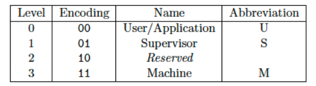

# RISC-V ISA
**It's about 2000 words, if there are any errors or problems, email me!**
## 1. Intro
RISC-V, pronounced "risk-five", is an open standard instruction set architecture(ISA) based on the principle of `reduced instruction set computing(RISC)`.

The development of RISC-V began in 2010 at the University of California, Berkeley, led by Professor Krste Asanović and his team. It was designed to support computer architecture research and education, as well as industrial implementations. The main goals were to create a free and open ISA that could be used across a wide range of computing devices, from small embedded systems to large-scale data centers. 

### 1.1. Origin of RISC-V
1. **Academic Roots**: RISC-V originated from academic research at UC Berkeley, aimed at simplifying and streamlining the instruction set to enhance performance and efficiency.
2. **Open Source**: Unlike proprietary ISAs, RISC-V is open-source, which means it is freely available to anyone, encouraging widespread adoption and innovation without the constraints of licensing fees or patents.
3. **Community and Ecosystem**: The RISC-V Foundation (now [RISC-V International](https://riscv.org/)) was established to promote the adoption of RISC-V and to manage its specifications. This non-profit organization has attracted a global community of contributors and supporters from academia, industry, and government.

### 1.2. Differences Between CISC and RISC
Before we get into RISC-V, we can understand the concepts of RISC and CISC. 

#### CISC (Complex Instruction Set Computing)
**Development:**
1. **Early Computing Era**: CISC architectures were developed during the 1960s and 1970s when memory was expensive and compilers were less advanced. The goal was to reduce the number of instructions per program, minimizing the load on memory.
2. **Instruction Richness**: CISC designs, such as IBM's System/360 and Intel's x86 architecture, included a large number of complex instructions, allowing a single instruction to perform multiple low-level operations like memory access, arithmetic, and branching.

**Characteristics:**
1. **Complex Instructions**: CISC architectures have a large set of instructions, some of which are highly specialized and complex.
2. **Variable Instruction Length**: Instructions can vary in length, which can complicate decoding and execution.
3. **Fewer Instructions Per Program**: Programs tend to have fewer instructions, but each instruction can do more work.
4. **Microprogramming**: Many CISC designs use microcode to implement complex instructions, allowing easier updates and modifications to the instruction set.

#### RISC (Reduced Instruction Set Computing)
**Development:**
1. **1980s Shift**: RISC architectures emerged in the late 1970s and early 1980s as a response to the growing understanding that simpler instructions could be executed more efficiently. Notable early RISC projects include IBM 801, Stanford MIPS, and Berkeley RISC.
2. **Focus on Speed and Simplicity**: RISC designs aimed to streamline instruction sets, making each instruction simple and fast to execute, which in turn improved performance and reduced power consumption.

**Characteristics:**
1. **Simple Instructions**: RISC architectures use a small, highly optimized set of instructions.
2. **Fixed Instruction Length**: Instructions are typically of uniform length, simplifying the decoding process.
3. **Load/Store Architecture**: RISC designs use a load/store approach, where operations are performed on registers, with separate instructions for memory access.
4. **Pipelining**: The simplicity of RISC instructions allows for efficient pipelining, where multiple instructions are overlapped in execution, increasing throughput.

#### Key Differences
| **Key Differences** | **CISC** | **RISC** |
|---|---|---|
| **Instruction Complexity**  | Uses complex instructions that can perform multiple operations. | Uses simple instructions, each performing a single operation. |
| **Instruction Set Size**    | Has a large set of instructions with many specialized ones.       | Has a small set of instructions focused on frequently used operations. |
| **Instruction Length**      | Uses variable-length instructions, complicating decoding.         | Uses fixed-length instructions, simplifying decoding and execution.         |
| **Execution Speed**         | Executes potentially slower due to complex instructions.  | Executes faster due to simpler instructions and efficient pipelining. |
| **Memory Usage**            | Requires fewer instructions per program, but each instruction can be more memory-intensive. | Requires more instructions per program, but each is less memory-intensive. |
| **Design Philosophy**       | Emphasizes reducing the number of instructions per program to save memory. | Emphasizes simplifying instructions to enhance execution speed and efficiency. |

#### Modern Context
- **CISC in Modern Processors**: Modern CISC processors, such as those based on the x86 architecture, incorporate many RISC principles internally. They use techniques like instruction translation and pipelining to improve performance.
- **RISC in Modern Processors**: RISC principles are widely adopted in various domains, from embedded systems to high-performance computing. Architectures like ARM (widely used in mobile devices) and RISC-V exemplify the success of the RISC approach.

### 1.3. Advantages of RISC-V
In the **software industry**, there are a large number of open source implementations of operating systems, compilers, databases, and so on, e.g., Linux, FreeBSD, C/LLVM, SQL, etc.

But for **hardware**, e.g., X86 and Arm, there are no large and widespread open source architectures. So, RISC-V came out of nowhere. 

RISC-V has a number of advantages as follows:

1. **Simplicity and Efficiency:**
RISC-V's design is straightforward, with a small number of core instructions, making it easier to implement and optimize. This simplicity also contributes to lower power consumption and higher performance. 

2. **Modularity and Extensibility:**
RISC-V is highly modular, allowing for the addition of custom extensions to the base ISA. This flexibility enables designers to tailor processors for specific applications without deviating from the standard architecture.

3. **Open Standard:**
Being open-source, RISC-V eliminate the costs associated with proprietary ISA, reducing barriers to entry and fostering innovation. Companies and developers can use, modify, and share RISC-V implementations freely. 

4. **Broad Industry Support:**
RISC-V has garnered significant support from major technology companies and academic institutions, leading to a robust ecosystem of tools, software, and hardware implementations.

5. **Scalability:**
 RISC-V is designed to be scalable across different computing domains, from micro controllers and IoT devices to high-performance computing and data centers.

6. **Security:**
The open nature of RISC-V allows for greater transparency and collaboration in developing security features, making it easier to identify and address potential vulnerabilities.

## 2. ISA
### 2.1. Naming Conventions
RISC-V ISA uses a systematic and structured naming convention to identify different features and extensions. This helps in understanding the capabilities and configurations of a particular RISC-V implementations. 

For the instruction set, it will have various naming formats, which can be divided into three main parts:

- RV：the abbreviation of RISC-V
- [xxxx]：concept of word widths
- [abcd....]：the set of instruction set modules supported by this processor. 

**Base ISA**
> The base ISA is identified by a single letter: **I(integer)**
> 
> It includes the basic instructions required for integer computation and control flow. 

**Extensions**

Extensions are added to the base ISA to provide additional functionalities. They are denoted by letters following the base ISA letter:

- M: Integer Multiplication and Division
- A: Atomic Instructions
- F: Single-Precision Floating-Point
- D: Double-Precision Floating-Point
- Q: Quad-Precision Floating-Point
- C: Compressed Instructions
- V: Vector Extensions
- B: Bit Manipulation
- P: Packed-SIMD Instructions
- T: Transactional Memory

and so on...

For example, **RV32IMA**, means RISC-V's 32-bit support for I-modules, M-modules and A-modules.

### 2.2. ISA Type
In the course of history, there are two kinds of ISA development, there are `incremental ISA` and `modular ISA`.

X86, for example, is a typical incremental ISA, in which case it will continue to iterate and develop, but will bring great learning pressure to those who learn later. And with the development of time, some ancient code has been difficult to find his function and role.

For example, RISC-V consists of 1 basic integer instruction set + multiple optional extended instruction sets, the base instruction set is fixed and will never change.

> **You can interpret it as local + DLC in Steam**

### 2.3. Module Combination

The basic integer instruction set is also divided into four types:
- **RV32I:** 32-bit integer instruction set
- **RV32E:** a subset of RV32I for embedded scenarios.
- **RV64I:** 64-bit integer instruction set
- **RV128I:** 128-bit integer instruction set.

Also the higher instruction set is backward compatible with the lower instruction set.

There are just many extension modules:
- **M:** Integer multiplication and division instruction set
- **A:** Atomic instruction set for memory.
- **F:** Single precision floating point instruction set
- **D:** Double-precision floating-point instruction set
- **C:** Compressed instruction set (there are some embedded systems that want an instruction set smaller than 32 bits for use in some space-poor hardware)

> **The IMAFD above is known as a general-purpose combination, and is denoted by the letter G.**

For example: `RV64GC`, which means general purpose + compression.

### **Attention!!**
**Q: What is the width of ISA**?
> It actually refers to the width of general-purpose registers in the CPU, which determines the size of the addressing range, and the ability to perform data operations. Examples include 8-bit, 32-bit, 64-bit processors, and so on.

It should be noted that the ISA width is independent of the width of the instruction code!

For example, on both 32-bit and 64-bit processors, the instruction word length of **RISC-V is 32 bits**.

## 3. Hardware Concepts
### 3.1. GPRs(General Purpose Registers)

The Unprivileged Specification for RISC-V defines 32 general-purpose registers, and a PC register.

This is the same for RV32I/RV64I/RV128I, and if the implementation supports F/D extensions, it needs to support an additional 32 floating-point registers.
The RV32E reduces the 32 registers to 16.

The width of the registers is specified by the ISA; the RV32 has a 32-bit register width, the RV64 has a 64-bit register width, and so on.

Each register is specifically programmed for a specific purpose and has a corresponding name that is defined by RISC-V's **Application Binary Interface (ABI)**.

### 3.2. Hart(Hardware Thread)
`Hart = Hardware Thread`
This concept is unique to RISC-V.

In a multi-core processor, each core may have one or more harts. e.g., a dual-core processor may have two harts(one for each core) or four harts(two for each core). 

Harts enable the processor to handle multiple tasks simultaneously, increasing the efficiency and speed of the system. Harts are independent work units in the processor that can execute multiple programs at the same time to improve computational efficiency. 

## 4. Software Concepts

### 4.1. Privilege Level
The Privileged Specification for RISC-V defines three special levels.

  

**The Machine level** is the highest level, which all implementations need to support, in addition to the **Supervisor** and **User** modes.

In Machine mode, memory is used at `physical addresses`, while Supervisor is used at `virtual addresses`.

The different privilege levels correspond to a set of `CSRs (Control and Status Registers)` for controlling and accessing the processor's operating state at the corresponding Level.

Higher-level privileged modes can access lower-level CSRs, e.g., M-mode can access S- or U-mode CSRs, and so on.

RISC-V defines instructions that are specifically designed to manipulate CSRs, and specific instructions can be switched between different privilege levels.

In future studies, we will use these registers gradually.

### 4.2. PMP 
**PMP(Physical Memory Protection)** is a feature in RISC-V that allows the configuration of memory access permissions.

It helps control access to different memory regions to ensure that only authorized code can read, write, or execute certain areas of memory.

RISC-V systems with PMP have s set of configuration registers, typically `pmpcfg` and `pmpaddr`. These registers define the access permissions and address ranges for memory regions. 

At the same time, RISC-V supports **virtual memory** through its standard privilege levels and the implementation of a virtual memory system.

Virtual memory allows programs to use a large, contiguous memory space without worrying about physical memory layout. 

Virtual Memory is managed using page tables, which map virtual addresses to physical addresses. Page tables are typically managed by the operating system's kernel. 

> **S-mode** must be supported if virtual memory is to be activated and can be used to implement advanced operating system features (Unix/Linux)

Physical memory protection allows M-mode to specify memory addresses that can be accessed by U-mode, supports **RWX privileges as well as Lock**.

## Appendix
1. [The Official RISC-V White Paper](https://github.com/riscv/riscv-isa-manual/releases/tag/riscv-isa-release-568e50a-2024-07-12)
2. [RISC-V's International Website](https://riscv.org/)