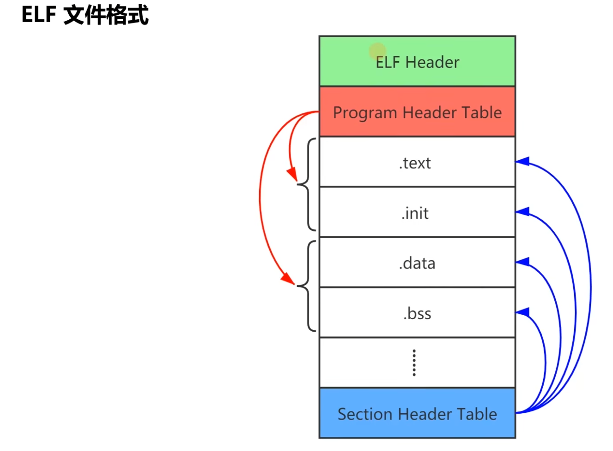

# Compilation toolchain
## 1. ELF
ELF(Executable and Linking Format) is a common binary file format on Linux platforms.

There are 4 types of files in ELF format defined in the ELF standard:
1. `.o file`: a relocatable file containing code and data, which can be linked into an executable file or a shared object file.
2. `a.out file`: an executable file
3. `.so file`: a shared object file
4. `.core file`: a core dump file. When a process terminates unexpectedly, the system can save part of the process content and other status information at the time of termination to this file for analysis and debugging. 

<p align="center">
  
</p>


There is more information about ELF here, if you need it, please check it out.
- [ELF File format](https://xinqiu.gitbooks.io/linux-inside-zh/content/Theory/linux-theory-2.html)
- [Wiki](https://en.wikipedia.org/wiki/Executable_and_Linkable_Format)
- 


## 2. Bin
Bin(binary) file is a computer file format that represents the contents of a file in binary code. These files usually contain computer programs or data, such as software/firmware, operating systems, documents, images, audio, and video.


### **What is the difference between Bin and ELF**
- **ELF**: is just like a book which has a specific format, containing executable files, object code, shared libraries, etc. It provides a standardized structure so that the OS can load and run these files. ELF files contain structures such as headers, segments, and sections, and describe the code, data, dynamic link information, etc. 
- **Bin**: is just like some paper which refer to a general binary file with no specific format requirements. It can contain any type of binary data, including but not limited to executable code, data file, etc. Bin file ij just a general reference to binary data, and ELF is a specific binary file format. 

## 3. Make


## 4. Cross Compile


## 5. QEMU


### GCC执行步骤


### GCC涉及的文件类型




Program Header Table是一个运行视图，这个地方不是很懂，还是需要再查询一下


下边是一个ELF文件处理的相关工具
[Binutils](https://www.gnu.org/software/binutils)


查看ELF的头信息，应该如何看呢？
```bash
readelf -h hello.o
```

这个可以查看一个.o文件的头

那如何查看链接视图呢？
```bash
readelf -SW hello.o
```
这个就能看到整个文件有多少个节。


那如何反汇编呢？
先用
```bash
gcc -g -c hello.c 
objdump -S hello.o
```
可以将hello.o进行反汇编，查看汇编代码，不过是有一内内痛苦的。


# 嵌入式开发的介绍
## 什么是嵌入式开发
嵌入式开发是一个比较综合性的技术，它不单指纯粹的软件技术开发，也不是一种硬件配置技术；它是在特定的硬件环境下针对某款硬件进行开发，是一种系统级别的与硬件结合比较紧密的软件开发技术。

可能是通过路由器把PC和Target Board连起来。

搞操作系统其实也是嵌入式开发的一种。


## 交叉编译
- Build：生成编译器可执行程序的计算机
- Host：运行编译器可执行程序，编译链接应用程序的计算机
- Target：运行应用程序的计算机


- 本地编译：Build == Host == Target
- 交叉编译：Build == Host != target

GNU交叉编译工具链Toolchain

命名格式：arch-vendor-os1-[os2-]XXX 

## 调试工具GDB
GNU的Debug的缩写，用于查看另一个程序在执行过程中正在执行的操作，或者该程序崩溃时正在执行的操作。

调试分为本地调试和远程调试，本地调试是我们用的最多一种调试方法，远程调试的话会使用到gdbserver来对目标机器进行调试。


## 模拟器QEMU
那什么又是模拟器呢？
我们主要用的模拟器是QEMU(Quick Emulation)。这个软件主要用在Linux下边，主要有两种模式，用户模式和系统模式。


QEMU可以只开一个进程来运行。
```bash
qemu-riscv32 ./a.out
```
如果是用这种方式的话，QEMU模拟的是U模式

System mode 模拟整个计算机系统，包括中央处理器及其他周边设备。

如果做系统开发，则一般来说使用System mode。


## 项目构造工具Make
make工具是一种自动化工程管理工具。
Makefile是配合make用于描述构建工程过程中所管理的对象以及如何构建工程。

Makefile三要素：target、prerequisites、command

关于如何速成Makefile，之后我也会写一个博客来简单讲解一下这个Makefile的规则。

规则分为缺省规则和伪规则。


除了学习这些之外，还得学习一些bash的语法。