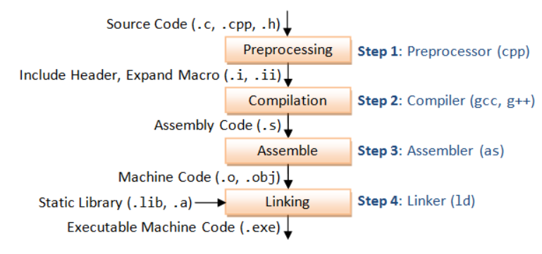
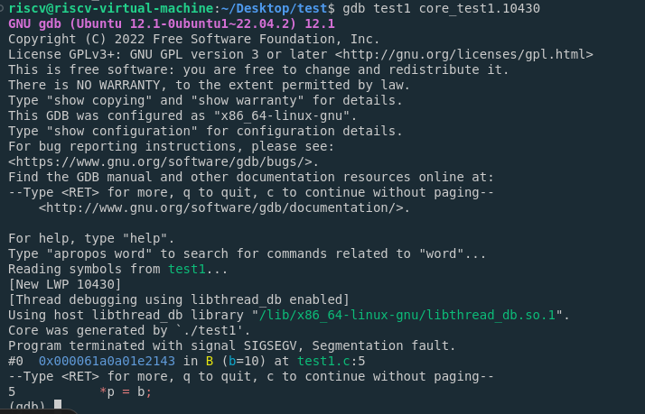
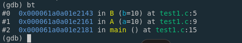
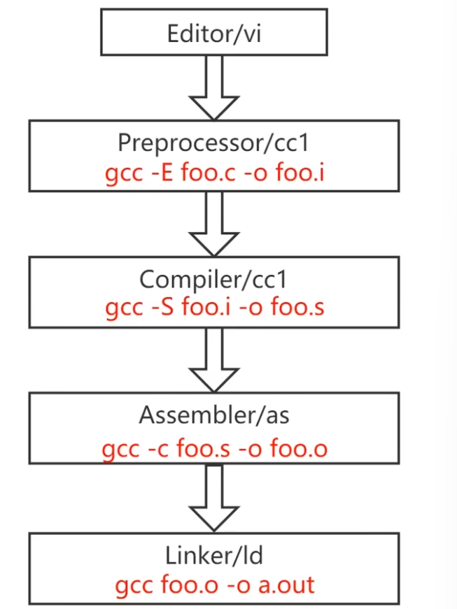
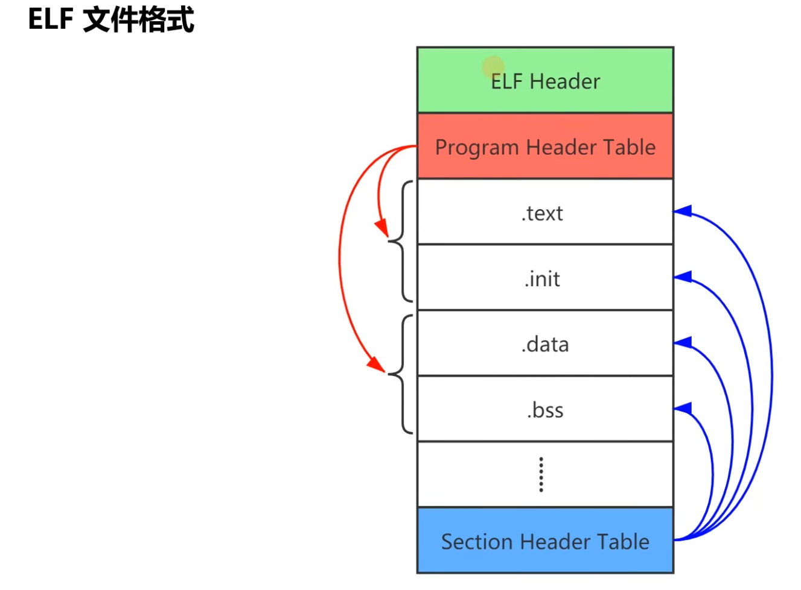

# Compile and Link
**It's about xxxx words, if there are any errors or problems, email me! 1416642324@bupt.edu.cn**

> Hello everyone, have a nice day! 
> Let's study together. 

## 1. GCC & GDB

### 1.1. GCC
**GCC (GNU Compiler Collection)** is a suite of compilers developed by GNU under the GPL license. It supports front-ends in C/C++/Objective-C, Ada, and Go languages, and has been ported to a variety of computer architectures, such as X86, ARM, RISC-V, and so on.

Now, let's look at the gcc version of the system first！

```bash
riscv@riscv-virtual-machine:~$ gcc --version

gcc (Ubuntu 11.4.0-1ubuntu1~22.04) 11.4.0
Copyright (C) 2021 Free Software Foundation, Inc.
This is free software; see the source for copying conditions.  There is NO
warranty; not even for MERCHANTABILITY or FITNESS FOR A PARTICULAR PURPOSE.
```
Before we happily use gcc, let's write a Hello world!
```c
#include <stdio.h>

int main() {
    printf("Hello world!\n");

    return 0;
}
```

This is a very, very simple code, we want to display Hello world on bash, so how do we use gcc?

Let me guess, maybe you want to use these command directly
```bash
gcc hello.c
./a.out

Hello world!
```
Woooo! The process is so easy that people think compiling events is a simple matter. Is this really the case? Let's take a closer look at how the C compilation process really works.

In fact, GCC has performed four steps：
1. Preprocessing
2. Compilation
3. Assemble
4. Linking

<p align="center">
  
</p>

This table includes some of the most commonly used tools in the GNU Compiler Collection suite, along with their primary functions.

| **Tool** | **Name** | **Function** |
|---|---|---|
| `gcc`    | GNU Compiler Collection | Compiles C, C++, and other languages into executable binaries.                             |
| `g++`    | GNU C++ Compiler  | Specifically compiles C++ programs.                                                          |
| `gdb`    | GNU Debugger      | Debugs programs by allowing the inspection and control of program execution.                 |
| `make`   | Make              | Automates the build process by reading a file called Makefile which specifies how to build the program. |
| `as`     | GNU Assembler     | Assembles assembly language source code into machine code.                                   |
| `ld`     | GNU Linker        | Links compiled object files into a single executable or library.                             |
| `ar`     | GNU Archiver      | Creates, modifies, and extracts from archives (collections of files) typically used for libraries. |
| `nm`     | Name List         | Lists symbols from object files, providing information about the contents of binaries.       |
| `objdump`| Object Dump       | Displays information about object files, such as disassembled code, symbols, and sections.   |
| `strip`  | Strip             | Removes symbols and other information from object files to reduce their size.                |

GCC is the front-end program for compilation, it is achieved by calling other programs to compile the program source files into target files. 

When compiling it first calls the `preprocessor program (cpp)` to process the input source program; then calls `cc1` to compile the preprocessed program into assembly code; and finally compiles the assembly code into target code by `as`.


### 1.2. GCC Usage 

Command format is as follows:
```bash
gcc [options] file......
```
The command gcc is followed by one or more options separated by spaces, and then by one or more target files.

such as:
```bash
gcc -g -c -o hello.o hello.c
```

There are some common options when using gcc
| Option | Implication | Example |
| --- | --- | --- |
| `-E` | Preprocess the specified source file without compiling it and generate a .i file | gcc -E hello.c| 
| `-S` | Compile the specified source file, but do not assemble it, and generate a .s file | gcc -S hello.c|
| `-c` | Compile and assemble but do not link, generate .o files| gcc -c test1.c test2.c test3.c |
| `-o file`| Save the output content in the file file| gcc main.c func.c -o ans.out|
| `-I dir`| Specify the search directory for include files| gcc hello.c -I ./include/ |
| `-g` | Generate debugging information, the program can be debugged by a debugger| gcc -g hello.c | 
| `-v` | Print out the commands executed during the compilation process | gcc -v hello.c  | 

In addition to these, there are many options related to warnings:
| Options | Meaning |
| --- | --- |
| `-w` | Turn off all warnings |
| `-Wall` | Turn on all warnings |
| `-Wimplicit` | If there is an implicit declaration, display a warning message|
| `-Wno-implicit` | Do not show warnings for implicit declarations | 


Now we can compile a slightly larger C project from scratch.


### 1.3. GDB

#### 1. Common Commands
Before using GDB, let's check whether it is currently installed, and its installed version.
```bash
riscv@riscv-virtual-machine:~/Desktop/test$ gdb -v
GNU gdb (Ubuntu 12.1-0ubuntu1~22.04.2) 12.1
Copyright (C) 2022 Free Software Foundation, Inc.
License GPLv3+: GNU GPL version 3 or later <http://gnu.org/licenses/gpl.html>
This is free software: you are free to change and redistribute it.
There is NO WARRANTY, to the extent permitted by law.

```
If not already installed, use the command: `sudo apt install gdb`

After successful installation, we can happily debug! 


However, when compiling a program with gcc, the compiled executable will not contain the source program code. If you want the compiled program to be debuggable, you need to add the `-g` parameter to the compiler.

Suppose we now have this code below:
```c
// hello.c
#include <stdio.h>

int main(int argc, char* argv[]) {
  if(argc != 2) {
    return 0;
  }
  printf("arg is %s\n", argv[1]);

  for(int i = 0; i < 10; i++) {
    printf("Current number is %d\n", i);
  }

  return 0;
}
```

Let's explore the various debugging strategies of gdb！
```bash
# set args xxx...: Setting the parameters of the main program
gcc -g hello.c -o hello
gdb hello
set args byebye

# break -> b: Setting breakpoints
b 20  # Indicates a breakpoint at line 20


# run -> r: Running the program to the first breakpoint
r

# next -> n: Executing the current statement, if the statement is a function call, it will not go to the function execution.
n

# step -> s: Executing the current statement, if the statement is a function call, then enter the function to execute the first statement in it.
s

# print -> p: Displaying variable values
p i


# continue -> c: Continue program execution until the next breakpoint
c

# set var name=value 
set var str1="Hello"
set var num2=30


# quit -> q: Exit the gdb environment
q


```


#### 2. Debugging core files
- **core means: memory**
- **dump means: throw out, pile out.**

When developing and using linux programs, sometimes the program is somehow down, but there is no hint (sometimes there is a hint of core dumped).

At this time, you can check whether there is a file generated in the form of: core, this file is the operating system to the program down when the contents of the memory thrown out of the generation, it can be used as a reference for debugging the program.

**Sometimes the program goes down, but the core file is not generated.**

The first thing is to know where the error occurred. Linux can generate a core file, and with `gdb` you can solve this problem.

The generation of core files is related to your current system environment settings, you can use the following statement to set up, and then run the program to generate the core file.

We can write a simple program to show this situation:
```c
#include <stdio.h>

void B(int b) {
    int*p = 0;
    *p = b;
}

void A(int a) {
    B(a);
}

int main() {

    int a = 10;
    A(a);


    return 0;
}
```

This code has a very obvious error at the location where the pointer is accessed. When we compile and run this code, it will report an error:
```bash
riscv@riscv-virtual-machine:~/Desktop/test$ gcc -g test1.c -o test1
riscv@riscv-virtual-machine:~/Desktop/test$ ./test1
Segmentation fault (core dumped)
```

Firstly, we can use `ulimit -a` to check out.
```bash
riscv@riscv-virtual-machine:~/Desktop/test$ ulimit -a
real-time non-blocking time  (microseconds, -R) unlimited
core file size              (blocks, -c) 0
data seg size               (kbytes, -d) unlimited
scheduling priority                 (-e) 0
file size                   (blocks, -f) unlimited
pending signals                     (-i) 63492
max locked memory           (kbytes, -l) 2041424
max memory size             (kbytes, -m) unlimited
open files                          (-n) 1024
pipe size                (512 bytes, -p) 8
POSIX message queues         (bytes, -q) 819200
real-time priority                  (-r) 0
stack size                  (kbytes, -s) 8192
cpu time                   (seconds, -t) unlimited
max user processes                  (-u) 63492
virtual memory              (kbytes, -v) unlimited
file locks                          (-x) unlimited

```
We can see that `core file size` is 0. So when a core dump occurs, it does not generate the file.

**Step1:** Lets the system generate core files in case of errors caused by signaling interrupts
```bash
ulimit -c unlimited # set core size is infinite
ulimit unlimited    # set file size is infinite
```


**Step2:** Compile the original program
```bash
gcc -g test1.c -o test1
```

**Step3:** Run the compiled program ans `ls`
```bash
./test1 
gdb test1 core
```
we can see the result
<p align="center">
  
</p>

Typing `bt` or `where` will bring up the location of the error, which will show you which line the program DOWN.
<p align="center">
  
</p>


#### 3. Debugging a Running Program
We can start by writing a program that takes a long time to run:
```c
#include<stdio.h>
#include<string.h>
#include<time.h>
int bb(int num) {
	int i = 0;
	for(; i < 100000; i++) {
		sleep(1);
		printf("i=%d\n",i);
	}
}

int aa(int num) {
	bb(num);
}


int main() {
	aa(1);
	return 0;

}
```
1. Run this program
```bash
gcc -g test.c -o test
```

2. Find the PID
Find the PID of your running program using commands like `ps`,`top`,or`pgrep`
```bash
riscv@riscv-virtual-machine:~/Desktop/test$ pgrep test
2822
```

3. Attach `gdb` to the Running Process
If we directly use `gdb test -p 2822` to attach, it is not permitted. So, use `sudo` to update your Permission.


#### 4. Debugging multi-process service programs


#### 5. Debugging multi-threaded service programs


## 2. ELF & Bin


## 3. Make


## 4. Cross Compile


## 5. QEMU





### GCC执行步骤


### GCC涉及的文件类型


## ELF
ELF(Executable Linkable Format)是一种Unix-like系统上的二进制文件格式标准。

ELF标准中定义的采用ELF格式的文件有4类：
1. .o文件：可重定位文件，包含了代码和数据，可以被链接成可执行文件或共享目标文件。
2. a.out文件：可执行文件
3. .so文件：共享目标文件
4. core文件：核心转储文件，进程意外终止时，系统可以将该进程的部分内容和终止时的其他状态信息保存到该文件中以供分析调试。


Program Header Table是一个运行视图，这个地方不是很懂，还是需要再查询一下


下边是一个ELF文件处理的相关工具
[Binutils](https://www.gnu.org/software/binutils)


查看ELF的头信息，应该如何看呢？
```bash
readelf -h hello.o
```

这个可以查看一个.o文件的头

那如何查看链接视图呢？
```bash
readelf -SW hello.o
```
这个就能看到整个文件有多少个节。


那如何反汇编呢？
先用
```bash
gcc -g -c hello.c 
objdump -S hello.o
```
可以将hello.o进行反汇编，查看汇编代码，不过是有一内内痛苦的。

