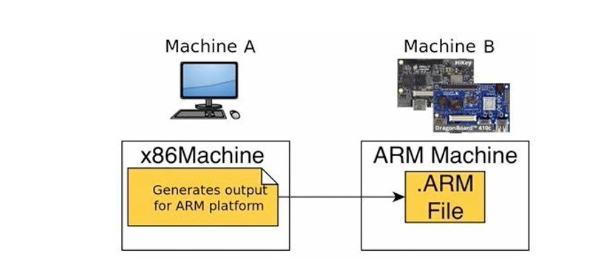
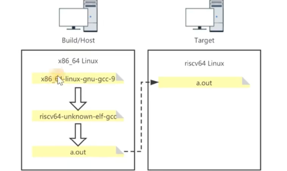

# Compilation toolchain
## 1. ELF
ELF(Executable and Linking Format) is a common binary file format on Linux platforms.

There are 4 types of files in ELF format defined in the ELF standard:
1. `.o file`: a relocatable file containing code and data, which can be linked into an executable file or a shared object file.
2. `a.out file`: an executable file
3. `.so file`: a shared object file
4. `.core file`: a core dump file. When a process terminates unexpectedly, the system can save part of the process content and other status information at the time of termination to this file for analysis and debugging. 

  

There is more information about ELF here, if you need it, please check it out.
- [ELF File format](https://xinqiu.gitbooks.io/linux-inside-zh/content/Theory/linux-theory-2.html)
- [Wiki](https://en.wikipedia.org/wiki/Executable_and_Linkable_Format)
- [Tools for ELF file](https://www.gnu.org/software/binutils)

## 2. Bin
Bin(binary) file is a computer file format that represents the contents of a file in binary code. These files usually contain computer programs or data, such as software/firmware, operating systems, documents, images, audio, and video.

### **What is the difference between Bin and ELF**
- **ELF**: is just like a book which has a specific format, containing executable files, object code, shared libraries, etc. It provides a standardized structure so that the OS can load and run these files. ELF files contain structures such as headers, segments, and sections, and describe the code, data, dynamic link information, etc. 
- **Bin**: is just like some paper which refer to a general binary file with no specific format requirements. It can contain any type of binary data, including but not limited to executable code, data file, etc. Bin file ij just a general reference to binary data, and ELF is a specific binary file format. 

## 3. Make
There are a lot of knowledge points in the Makefile part. If I explain it in detail, it may take weeks. Therefore, I have compiled a lot of good tutorials for you. You can not only watch the videos, but also check the documents.

**Let us take action**
The two most important concepts in Makefile are `target` and `dependency`.
- Target refers to what we want make to do.
- Dependency describes how to achieve what we want to to, that is how to do it. 

The ultimate goal of mastering Makefile is that we can use targets and dependencies to think about the problems that need to be solved. 

**Docs**
- [驾驭Makefile](http://cicpi.ustc.edu.cn/indico/getFile.py/access?contribId=2&resId=0&materialId=slides&confId=839)
- [廖雪峰学Makefile](https://liaoxuefeng.com/books/makefile/introduction/)
- [阮一峰Makefile教程](https://www.ruanyifeng.com/blog/2015/02/make.html)

**Video**
- [为什么要用Makefile](https://www.bilibili.com/video/BV188411L7d2/?spm_id_from=333.337.search-card.all.click&vd_source=3edb456fe9b280bb4ab8f6e18448ace0)
- [手把手学make](https://www.bilibili.com/video/BV1Bv4y1J7QT/?spm_id_from=333.337.search-card.all.click&vd_source=3edb456fe9b280bb4ab8f6e18448ace0)

## 4. Cross Compile
> We must understand three words: Build, Host, Target.
- **Build**: The computer that generates the compiler executable program
- **Host**: The computer that runs he compiler executable program and compiles and links the application
- **Target**: The computer that runs the application

  

- **native compile**: Build == Host == Target
- **cross compile**:  Build == Host != Target

  

If you want to learn more about cross-compilation, please check out the following documents：

- [交叉编译是什么](https://worktile.com/kb/ask/54570.html)
- [如何安装risc-v交叉编译链(有中科大打包好的)](https://soc.ustc.edu.cn/CECS/lab0/riscv/)
- [手把手编译risc-v交叉编译链](https://www.riscv-mcu.com/article-show-id-404.html)
- [交叉编译命名格式](https://blog.csdn.net/LEON1741/article/details/81537529)
  

## 5. QEMU
[QEMU](https://www.qemu.org/)(Quick Emulation) is mainly used in Linux and has two main modes, `user mode` and `system mode`.

Since the knowledge and content of QEMU are too vast, you can first master the usage and core concepts, and then slowly supplement them!

[QEMU KVM学习笔记](https://yifengyou.github.io/learn-kvm/)
[ARM 版本QEMU搭建](https://wowothink.com/90fb723e/)
[RISC-V版本QEMU搭建(待定)]()
[QEMU 源码分析笔记](https://blog.51cto.com/AppleCai/7835439)