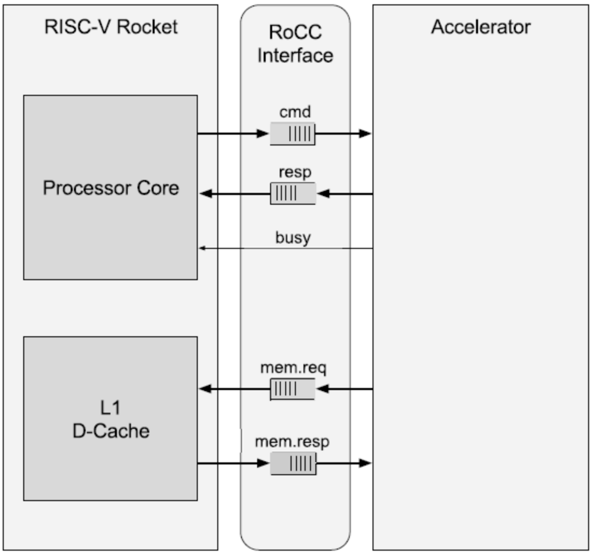

# 关于Rocket Chip你所需知道的一切
## 1. Rocket-Chip概述
Rocket Chip是一个基于Chisel的开源SoC生成器，它包含顺序执行的Rocket核心和乱序执行的BOOM核心，具有高度的可配置性，支持定制加速器。通过核生成器、缓存、ROCC接口、TileLink总线和外围设备，Rocket Chip能够构建多核SoC系统。
<p align="center">
    
</p>

### 1. Chisel和FIRRTL
Chisel可以生成可以综合的Verilog代码，具体关于Chisel的学习可以跳转到Chisel系列中。

为了将Chisel转变成Verilog，语言开发人员开发了一套中间标准交换格式——FIRRTL，它和Verilog是同一个级别的，两者都比Chisel低一级。编写的Chisel代码首先会经过FIRRTL编译器，生成FIRRTL代码，也就是一个后缀格式为".fir"的文件，然后由这个FIRRTL文件再去生成对应的Verilog代码。FIRRTL生成的格式和Verilog格式很接近，只不过是由机器生成的、很死板的代码，并且FIRRTL编译器也并不是只针对Chisel。

### 2. Rocket-Chip基本结构
Rocket Chip架构中最核心的组成部分是Rocket核心。主要包括几个部分：
- Rocket核心
- 瓦片连接TileLink
- 外设接口PLIC、CLINT等
- 缓存系统Cache
- BootROM

这些模块通过TileLink高效地进行通信。


### 3. TileLink片上总线
TileLink是近几年由伯克利孕育的芯片初创公司SiFive提出的一种全新的芯片级总线互连标准，允许多个主设备(masters)以支持一致性的存储器映射(memory-mapped)方式访问存储器和其他从端(slave)。TileLink的设计目标，是为SoC提供一个具有低延迟和高吞吐率传输的高速、可扩展的片上互连方式，来连接通用多处理器、协处理器、加速器、DMA以及各类简单或复杂的设备。


TileLink是一个协议框架，设计为多个缓存一致性策略的基板。其目的是将通信网络的设计和缓存控制器的实现与一致性协议本身的设计分离开来。这种关注点分离改进了内存层次结构的HDL描述的模块化，同时也使各个内存系统组件更加易于验证。

**协议扩展**

TileLink 支持多种类型的通讯代理模块，并定义了三个从简单到复杂的的协议扩展级别。每个级别定义了兼容该级别的通讯代理模块需要支持的协议扩展子集，如下表所示。最简单的是 TileLink 无缓存轻量级(Uncached Lightweight, TL-UL)，只支持简单的单个字读写(Get/Put)的存储器操作。相对复杂的 TileLink无缓存重量级(Uncached Heavyweight,TL-UH)，添加了预处理(hints)、原子访问和突发访问支持，但不支持一致性的缓存访问。最后，缓存支持级 TileLink Cached(TL-C)是最复杂，也是最完整的协议，支持使用一致性的缓存模块。
<p align="center">
    
</p>

如果有需要了解更多与TileLink有关的资料，可以查阅一下资料：
- [SiFive的TileLink和ARM对比](https://zhuanlan.zhihu.com/p/430486422?utm_id=0&wd=&eqid=dd913b41000289fb000000026497df94)
- [架构与描述](https://zhuanlan.zhihu.com/p/566522887)
- [序列化，死锁避免，操作和消息](https://zhuanlan.zhihu.com/p/566522887)
- [TL-UL](https://zhuanlan.zhihu.com/p/575707311)
- [TL-UH](https://zhuanlan.zhihu.com/p/575707358)
- [TL-C](https://zhuanlan.zhihu.com/p/575707393)
- [UCB-BAR:TileLink](https://bar.eecs.berkeley.edu/projects/tilelink.html)
- [TileLink-Spec-1.8](https://sifive.cdn.prismic.io/sifive/cab05224-2df1-4af8-adee-8d9cba3378cd_tilelink-spec-1.8.0.pdf)
- [TileLink总线协议分析](https://jia.je/hardware/2022/05/09/tilelink/)
- [Chisel IC敏捷设计 TileLink一致性协议介绍](https://zhuanlan.zhihu.com/p/487836257)

### 4. 缓存一致性
一致性在中文只有三个字，但是对应英文却有两个意思：
- 内存一致性 Memory Consistency
- 缓存一致性 Cache Coherence


缓存一致性协议的场景为：
在多核CPU中，每个核心都有自己的缓存，为了保证这些缓存的数据一致，设计了缓存一致性协议。

主要分为两种协议：
- **写无效 Write Invalidate**：写入数据的时候，将其他Cache中这条Cache Line设为Invalid
- **写更新 Write Update**：写入数据的时候，把新的结果写入到有这条Cache Line的其他Cache

这个是我在GEM 5的[学习教程]中找到的一段文字：
<p align="center">
    
</p>

**coherence和consistency的区别是什么？**
在计算机科学中，一致性（consistency）和连贯性（coherence）在不同的上下文中有着特定的含义和应用。下面是这两个概念在计算机科学中的区别：

**一致性（Consistency）**

一致性在计算机科学中通常指的是数据的一致性，特别是在分布式系统和数据库领域。其含义是确保系统中所有副本的数据在任何时刻都是相同的或至少符合某种规则。

- **分布式系统中的一致性**：
  - **定义**：在分布式系统中，一致性意味着多个副本的数据在任何时刻都要保持一致，或者在进行更新后，系统中的所有副本最终达到一致的状态。
  - **类型**：
    - **强一致性（Strong Consistency）**：每次读操作都会返回最新的写操作结果，即所有的读操作都能看到最近的写操作。
    - **最终一致性（Eventual Consistency）**：虽然系统中的数据副本在短时间内可能不一致，但随着时间的推移，所有副本最终会达到一致。
    - **因果一致性（Causal Consistency）**：保证因果关系的操作顺序的一致性，即保证相关操作的顺序一致。
  - **例子**：
    - 在一个分布式数据库中，当一个节点更新了数据，所有其他节点最终会接收到该更新，确保所有节点的数据是一致的。

**连贯性（Coherence）**

连贯性在计算机体系结构和并发控制中通常指的是缓存连贯性（cache coherence），其含义是确保在多处理器系统中，各个处理器的缓存中的数据是一致的。

- **缓存连贯性**：
  - **定义**：在多处理器系统中，缓存连贯性确保多个处理器缓存中同一内存位置的数据是一致的。也就是说，如果一个处理器更新了某个内存位置的数据，其他处理器在读取该位置时能够看到最新的数据。
  - **协议**：
    - **MSI、MESI、MOESI**等协议：这些协议通过一组状态（如修改、共享、无效等）来管理缓存行，确保缓存数据的一致性。
  - **例子**：
    - 在一个多核处理器系统中，如果一个核心修改了变量X的值，那么其他核心在访问变量X时，能够看到这个修改后的值，而不会读到旧值。

**总结**

- **一致性（Consistency）**：主要在分布式系统和数据库中使用，指的是多个数据副本在任何时刻都保持相同的状态或最终达到一致的状态。
- **连贯性（Coherence）**：主要在计算机体系结构和并发控制中使用，指的是在多处理器系统中，确保各处理器缓存中同一内存位置的数据是一致的。

**简单来讲**：1.coherence确定了读取操作可能返回什么值； 2.consistency确定了写入值什么时候读取操作返回。

[杰哥的缓存一致性协议](https://jia.je/kb/hardware/cache_coherence_protocol.html#write-once)这个博客中很好的讲述了他们的区别，感兴趣的同学可以进一步查阅。

其中也具体讲到了*TileLink协议*的硬件实现方式。

### 5. RoCC
RISC-V支持通过自定义指令的方式，支持自定义硬件加速器，用于专用领域的计算加速设计。

RoCC便是一款处理器添加扩展的方案。

RISC-V的ISA定义了四种自定义指令用于与协处理器进行交互。

```asm
customX rd, rs1, rs2, funct
```
标准自定义指令格式如下：
<p align="center">
    
</p>
其中rs1, rs2为源寄存器，rd为目的寄存器，xd,xs1,xs2为寄存器有效位，分别指令rd,rs1,rs2是否已经使用。

opcode为四种不同的custom指令。

RoCC接口由多组不同的Wire和Bundle组成，如下图所示：
<p align="center">
    
</p>

其中cmd包含两个源寄存器的内容和整条指令内容。resp包含目的寄存器。cmd和resp均为Decoupled接口。

Decoupled接口是一种基于FIFO，类似ready/valid协议，请求方（core A）准备好data信号并拉高valid线，等待core B相应ready信号线的拉高，如果Core B可以立即响应，则可以在同一周期内拉高信号。
<p align="center">
    
</p>

## 2. Rocket处理器
### 1. 标量处理器 Rocket


### 2. 超标量乱序执行处理器 Boom


### 3. SiFive的Freedom系列


### 4. lowRISC

参考链接：
> [lowRISC在中国的发展](https://wsong83.github.io/presentation/riscv201804.pdf)

