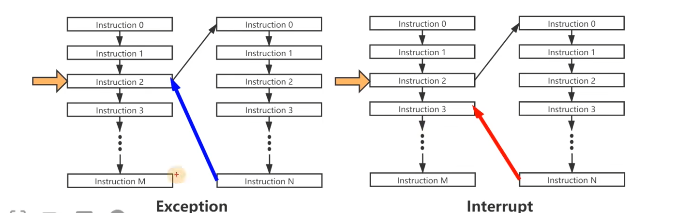

# RISC-V ISA
## 1. Intro
RISC-V, pronounced "risk-five", is an open standard instruction set architecure(ISA) based on the principle of `reduced instruction set computing(RISC)`.

The development of RISC-V began in 2010 at the University of California, Berkeley, led by Professor Krste Asanović and his team. It was designed to support computer architecture research and education, as well as industrial implementations. The main goals were to create a free and open ISA that could be used across a wide range of computing devices, from small embedded systems to large-scale data centers. 

### 1.1. Origin of RISC-V
1. **Academic Roots**: RISC-V originated from academic research at UC Berkeley, aimed at simplifying and streamlining the instruction set to enhance performance and efficiency.
2. **Open Source**: Unlike proprietary ISAs, RISC-V is open-source, which means it is freely available to anyone, encouraging widespread adoption and innovation without the constraints of licensing fees or patents.
3. **Community and Ecosystem**: The RISC-V Foundation (now RISC-V International) was established to promote the adoption of RISC-V and to manage its specifications. This non-profit organization has attracted a global community of contributors and supporters from academia, industry, and government.

### 1.2. Differences Between CISC and RISC
Before we get into RISC-V, we can understand the concepts of RISC and CISC. 

#### CISC (Complex Instruction Set Computing)
**Development:**
1. **Early Computing Era**: CISC architectures were developed during the 1960s and 1970s when memory was expensive and compilers were less advanced. The goal was to reduce the number of instructions per program, minimizing the load on memory.
2. **Instruction Richness**: CISC designs, such as IBM's System/360 and Intel's x86 architecture, included a large number of complex instructions, allowing a single instruction to perform multiple low-level operations like memory access, arithmetic, and branching.

**Characteristics:**
1. **Complex Instructions**: CISC architectures have a large set of instructions, some of which are highly specialized and complex.
2. **Variable Instruction Length**: Instructions can vary in length, which can complicate decoding and execution.
3. **Fewer Instructions Per Program**: Programs tend to have fewer instructions, but each instruction can do more work.
4. **Microprogramming**: Many CISC designs use microcode to implement complex instructions, allowing easier updates and modifications to the instruction set.

#### RISC (Reduced Instruction Set Computing)
**Development:**
1. **1980s Shift**: RISC architectures emerged in the late 1970s and early 1980s as a response to the growing understanding that simpler instructions could be executed more efficiently. Notable early RISC projects include IBM 801, Stanford MIPS, and Berkeley RISC.
2. **Focus on Speed and Simplicity**: RISC designs aimed to streamline instruction sets, making each instruction simple and fast to execute, which in turn improved performance and reduced power consumption.

**Characteristics:**
1. **Simple Instructions**: RISC architectures use a small, highly optimized set of instructions.
2. **Fixed Instruction Length**: Instructions are typically of uniform length, simplifying the decoding process.
3. **Load/Store Architecture**: RISC designs use a load/store approach, where operations are performed on registers, with separate instructions for memory access.
4. **Pipelining**: The simplicity of RISC instructions allows for efficient pipelining, where multiple instructions are overlapped in execution, increasing throughput.

#### Key Differences
| **Key Differences** | **CISC** | **RISC** |
|---|---|---|
| **Instruction Complexity**  | Uses complex instructions that can perform multiple operations. | Uses simple instructions, each performing a single operation. |
| **Instruction Set Size**    | Has a large set of instructions with many specialized ones.       | Has a small set of instructions focused on frequently used operations. |
| **Instruction Length**      | Uses variable-length instructions, complicating decoding.         | Uses fixed-length instructions, simplifying decoding and execution.         |
| **Execution Speed**         | Executes potentially slower due to complex instructions.  | Executes faster due to simpler instructions and efficient pipelining. |
| **Memory Usage**            | Requires fewer instructions per program, but each instruction can be more memory-intensive. | Requires more instructions per program, but each is less memory-intensive. |
| **Design Philosophy**       | Emphasizes reducing the number of instructions per program to save memory. | Emphasizes simplifying instructions to enhance execution speed and efficiency. |

#### Modern Context
- **CISC in Modern Processors**: Modern CISC processors, such as those based on the x86 architecture, incorporate many RISC principles internally. They use techniques like instruction translation and pipelining to improve performance.
- **RISC in Modern Processors**: RISC principles are widely adopted in various domains, from embedded systems to high-performance computing. Architectures like ARM (widely used in mobile devices) and RISC-V exemplify the success of the RISC approach.

### 1.3. Advantages of RISC-V
1. **Simplicity and Efficiency:**
RISC-V's design is straightforward, with a small number of core instructions, making it easier to implement and optimize. This simplicity also contributes to lower power consumption and higher performance. 

CISC(Complex Instruction Set Computing)
针对特定的功能实现特定的指令，指令数目比较多，生成的程序相对会短一些。

RISC(Reduced Instruction Set Computing)
只定义寻常指令，复杂功能采用指令组合的方式，指令数精简，但生成的程序长度相对较长。

**问：什么是ISA的宽度**
> 实际上指的是CPU中通用寄存器的宽度，决定了寻址范围的大小、数据运算的能力。例如8位，32位、64位处理器等等。

需要注意的是，ISA宽度和指令编码的宽度无关！
例如无论是在32位还是64位的处理器上，RISC-V的指令字长都为32位。

## RISC-V ISA基本介绍
从软件业界来说，不管是操作系统，还是编译器，还是数据库等等，都有大量的开源实现，例如Linux、FreeBSD、C/LLVM、SQL等等。
但是对于硬件来说，例如X86和Arm，都并没有大量且广泛的开源架构，因此RISC-V横空出世。

RISC-V是Berkeley研发的第五代精简指令集。是2010年加州大学伯克利分校开发的一款ISA，用于科研和教学。

主要的研发人员有：
Andrew Waterman、Yunsup Lee, David Patterson, Krste Asanovic

之后的几年中RISC-V还成立了[基金会](https://riscv.org/)，适用于所有类型的计算系统，从微控制器到超级计算机，所有的厂家和个人都可以基于RISC-V开发和扩展。

RISC-V从学校发展到现在，生态发展也是越来越迅速，目前RISC-V成员已经超过700个，分布在全球50个国家和地区，而目前中国的参与也是非常强劲的。

## RISC-V指令集的特点
RISC-V指令集核心的特点就是：简单、分层清晰、模块化、稳定与社区化

RISC-V的产生比较晚，所以在设计过程中减少了很多弯路，设计更加简单。
其中特权级别便是分层的具体表现。
模块化体现在各个扩展上。
稳定化就是说它的指令集长度比较固定。
社区化就是说它可以允许进行讨论和公开，而不是由一家公司说了算。

## ISA的命名规范
对于指令集来说，它会有各种命名格式，主要可以分成三部分：
- RV：就是RISC-V的缩写
- [xxx]：表示字宽的概念
- [abcd....]：标识该处理器支持的指令集模块集合。

例如：RV32IMA，就是说RISC-V的32位支持I模块、M模块和A模块。

在历史的发展过程中，分为两种ISA的发展，有增量ISA和模块化ISA。
例如X86，就是典型的增量级ISA，这样的话就会不断迭代与发展，但是会给后来学习的人带来极大的学习压力。而且随着时间的发展，有些古早的代码已经很难发现他的功能及作用了。

例如RISC-V由1个基本整数指令集+多个可选的扩展指令集组成，基础指令集是固定的，永远都不会变。例如Steam中本地+DLC的形式。

基本整数指令集也分为四种：
- RV32I：32位整数指令集
- RV32E：RV32I的子集，用于嵌入式场景。
- RV64I：64位整数指令集
- RV128I：128位整数指令集。
同时高位指令集会向下兼容低位指令集。

扩展模块就有很多：
- M：整数乘法与除法指令集
- A：存储器的原子（Automic）指令集
- F：单精度浮点指令集
- D：双精度浮点指令集
- C：压缩指令集（有一些嵌入式系统希望指令集小于32位，用于一些空间不足的硬件中）

上边的IMAFD被称为通用组合，用英文字母G来表示。

例如：RV64GC，也就是说通用+压缩。

## 通用寄存器
通用寄存器全称是General Purpose Registers。

RISC-V的Unprivileged Specification定义了32个通用寄存器，以及一个PC。
对于RV32I/RV64I/RV128I都是一样的，如果实现支持F/D扩展，则需要额外支持32个浮点寄存器。
RV32E将32个寄存器缩减为16个。

寄存器的宽度是由ISA指定的，RV32的寄存器宽度为32位，RV64的寄存器宽度为64位，以此类推。

每个寄存器具体编程的时候都有特定的用途，并且都有对应的名字，是由RISC-V的Application Binary Interface（ABI）定义。

## 硬件线程Hart
Hart = Hardware Thread
这个概念是RISC-V独有的概念。

早起都是处理器，一个CPU只能顺序执行一条指令。随着硬件的发展，一个CPU中有两个执行流或者多个执行流。

hart是一种能够独立fetch和execute指令的环境。

## 特权级别
RISC-V的Privileged Specification定义了三个特别级别。
Machine级别是最高的级别，所有的实现都需要支持，除此之外还有Supervisor和User模式。
在Machine模式中，内存都是用物理地址，而Supervisor就是用虚拟地址。

在不同的特权级别下，分别对应着一套各自的CSRs(Control and Status Registers)，用于控制和获取相应Level下的处理器工作状态。

高级别的特权模式下可以访问低级别的CSR，例如M模式可以访问S或者U模式的CSR，一次类推。

RISC-V定义了专门用于操作CSR的指令，并且特定的指令可以在不同特权级别之间进行切换。

## 内存管理与保护
物理内存保护（Phsical Memory Protection，PMP）
虚拟内存（Virtual Memory）

如果要启动虚拟内存，必须要支持S模式，可以用于实现高级的操作系统特性（Unix/Linux）

物理内存保护允许M模式指定U模式可以访问的内存地址，支持RWX权限以及Lock

## 异常和中断

异常Exception，异常处理完之后会再次回到刚刚发生异常的地方。（程序自己发现出问题了，然后自己去挽救）

中断Interrupt，中断发生后，会执行一段中断处理函数，会返回到中断处理的下一段执行函数。