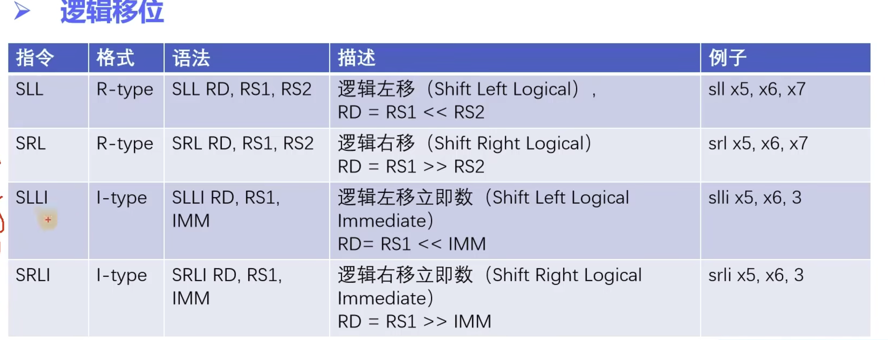

# RISC-V汇编语言入门
## 指令入门
在学习汇编的过程中我们主要参考两套文档：
- [RISC-V的非特权指令集]()
- [Binutils文档](https://sourceware.org/binutils/docs/as/)

汇编语言是一种低级语言，它拥有诸多缺陷，例如难读、 难写、难移植，但是它又非常灵活和强大。汇编经常应用在需要直接访问底层硬件的地方，并且它可以对性能进行极致的优化。


一个完整的RISC-V汇编程序有多条语句（statement）组成。

一条经典的RISC-V汇编语句由三部分组成：

```
[label:] [operation] [comment]
```

- label: 在GNU汇编中，任何以冒号结尾的标识符都被认为是一个标号。
- operation：主要有以下四种类型
    - instruction：直接对应二进制机器指令的字符串
    - pseudo-instruction(伪指令)：为了提高编写代码的效率，用一条伪指令指示汇编器产生的多条实际指令。
    - directive(指示)：通过类似指令的形式，但是主要是给汇编器看的，进行特殊处理
    - macro：采用.macro/.endm自定义的宏。
- comment：注释，最常用的是#开头


## 指令总览
RISC-V的操作对象分为两大类：寄存器/内存
- 寄存器：32个通用寄存器，在RISC-V中，Hart在执行算数逻辑运算时所操作的数据必须直接来自寄存器。Hart在执行算数逻辑运算时操作的数据必须来自寄存器。

- 内存：Hart可以执行在寄存器和内存之间的数据读写操作，并且以Byte为基本单位进行寻址，RV32最多可以访问2^32个字节的内存空间。


x0是一个非常特殊的寄存器，实际上只读的，且永远为0，XLEN表示寄存器的位数，例如32位、64位等等。PC寄存器并不能直接访问，需要用一些特殊的技巧。


RISC-V 汇编指令编码格式

汇编指令有指令长度、指令对齐等各种概念。
- 指令长度：ILEN1=32bits （RV32I）
- 指令对齐：IALIGN=32bits（RV32I）

32个bit划分成不同的“域”，例如rd、opcode、funct3等等，funct3/funct7和opcode一起决定最终的指令类型。3表示占了3个bit，7表示占用了7个bit。

指令在内存中按照`小端`排列。

小端序的概念（主机字节序HBO-Bost Byte Order）
一个多字节整数在计算机内存中存储的字节顺序称为主机字节序，或者叫本地字节序。

不同类型的CPU的HBO不同，这与CPU的设计有关，分为大端序和小端序。

- 大端序：高位放在低字节（倒序）
- 小端序：低位先进低字节（顺序）

6种指令格式：RISUBJ，后边会具体的讲到他们的作用，现在也记不住，咱们慢慢来。

指令分类：
- 算数运算指令
- 逻辑运算指令
- 移位运算指令
- 内存读写指令
- 分支与跳转指令


## 指令进阶

### 1. 算数运算指令
(Arithmetic Instructions)
包括ADD和SUB，不包括MUL和DIV，他们是扩展模块。

ADD是R-type，也就是寄存器类型

|语法|ADD RD, RS1, RS2 |含义|
|---|---|---|
|例子|add x5, x6, x7| x5 = x6 + x7|


最终汇编指令可以变成机器码：`0x007302B3`


SUB同样是R-Type，是寄存器类型
|语法|SUB RD, RS1, RS2 |含义|
|---|---|---|
|例子|sub x5, x6, x7| x5 = x6 - x7|


ADDI (ADD immediate) I-Type
|语法|ADDI RD, RS1, IMM |含义|
|---|---|---|
|例子|addi x5, x6, -5| x5 = x6 + (-5)|

imm(12)：立即数占12位。

在参与算术运算前，该immediate会被符号扩展为一个32位的数。

RISC-V的ISA并没有提供SUBI的指令


ADDI具有局限性，如果给寄存器赋值范围超了怎么办？

RISC-V选择引入一个新的命令先设置高20位，存放在rs1，然后服用现有的ADDI命令补上剩余的低12位即可。

LUI(Load Upper Immediate) U-Type
|语法|LUI RD, IMM|含义|
|---|---|---|
|例子|lui x5, 0x12345| x5 = 0x12345 << 12|
LUI指令会构造一个32bits的立即数，这个立即数的高20位对应指令中imm，低12位清零，这个立即数作为结果存放在RD中。

例如：利用LUI+ADDI来作为寄存器加载一个大数0x12345678

```
lui x1, 0x12345     # x1 = 0x12345000
addi x1, x1, 0x678  # x1 = 0x12345678
```

但是会存在问题，当构造0x12345FFF的时候
```
lui x1, 0x12345     # x1 = 0x12345000
addi x1, x1, 0xFFF  # x1 = 0x12345FFF (注意符号位)
```


为了简化这个工作，有一个LI的伪指令
|语法|LI RD, IMM|含义|
|例子|li x5, 0x12345678 | x5 = 0x12345678|

LI(Load Immediate)是一个伪指令(pseudo-instruction)
汇编器会根据IMM实际情况自动生成正确的真实指令。


减轻了很多的工作量。


AUIPC - U-Type
|语法|AUIPC RD, IMM|含义|
|---|---|---|
|例子|auipc x5, 0x12345|x5 = 0x12345 << 12 + PC|

和LUI类似，AUIPC也是会构造一个32bits的立即数，这个立即数的高20位对应指令中的imm，低12位会清零，但和LUI不同的是，AUIPC会先将这个立即数和PC值相加，将相加后的结果存放到RD中。


LA(Load Address) - 伪指令

|语法|LA RD, LABEL|
|---|---|
|例子|la x5, f00|

具体编程时给出需要加载的label，编译器会根据实际情况利用auipc和其他指令自动生成正确的指令序列，常用于加载一个函数或者变量的地址。


### 2. 逻辑运算指令
与或非(Logical Instructions)


RISC-V提供了AND、OR、XOR，分别对应与，或，异或
异或就是两个值相同，则为0，两个值不同，则为1.

NOT-伪指令，提供了一个取非操作。

|伪指令|语法|等价指令|描述|例子|
|---|---|---|---|---|
|NOT|NOT RD, RS| XORI RD, RS, -1 | 对RS的值按位取反，结果存放在RD中|not x5, x6|


### 3. 移位运算指令



无论是逻辑左移还是逻辑右移，补足的都是0.

算数右移时，按照符号位的值来补足。

算数运算是不会做左移的，可以用来做除法。

### 4. 内存读写指令
Load and Store Instructions
内存读指令：Load，将数据从内存读入到寄存器
内存写指令：Store，将数据从寄存器写到内存。


分为符号扩展和零扩展。


向外写是没有扩展的问题。


### 5. 条件分支指令


上边是基本的条件分支指令，但也有很多伪指令

```r
li x5, 0
li x6, 0
loop:
    addi x5, x5, 1
    bne x5, x6, loop
```


make debug

si - 单步执行命令


### 6. 无条件跳转指令
Unconditional Jump Instructions

针对函数跳转设计出来的指令

JAL(Jump And Link)
|语法|JAL RD, LABEL|
|---|---|
|例子|jal x1, label|

JAL指令使用J-Type编码格式，用于调用子过程。

子过程的地址计算方法：首先对20bits宽的IMM*2后进行sign-extended，然后将符号扩展后的值和PC值相加。因此该函数跳转的范围是以PC为基准，上下浮动1MB。

JAL指令的下一条指令的地址写入RD，保存为返回地址。


JALR(Jump And Link Register)
JALR指令使用I-type编码格式，和JAL的区别是跳转目标地址的计算方式不同，因此该函数范围是以RS1为基准，上下浮动2KB，JALR指令的下一条指令的地址写入RD，保存为返回地址。

也就是说，JAL相当于绝对跳转，JALR相当于相对跳转


如何解决更远距离的跳转？

AUIPC+JALR

如果跳转之后不需要返回，可以放在x0
|伪指令|语法|等价指令|例子|
|---|---|---|---|
|J|J OFFSET| JAL X0, OFFSET| j leap|
|JR|JR RS| JALR X0, 0(RS) | jr x2|


## 函数调用约定
函数栈

函数A的栈帧（自行分配）

Caller调用者、Callee被调用者

调用参数、返回地址和返回参数都需要放在特定的地方（需要特定寄存器）

- 有关寄存器的约定


保存临时寄存器是放在Caller的栈中。

Saved表示，在栈中备份寄存器，并且在退出函数的时候恢复。


提高函数调用的效率问题，防止每次全拷贝寄存器。


- 函数跳转和返回指令的编程约定


- 实现被调函数的编程约定


## 汇编与C混合编程

