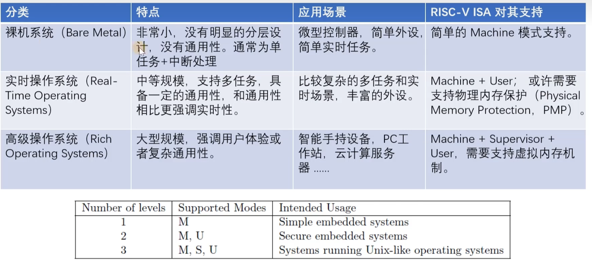

# 开始设计RVOS
操作系统(Operating System)，是一组系统软件程序：
- 主管并控制计算机操作、运用和运行硬件、软件资源
- 提供公共服务来组织用户交互

操作系统划分：
- 狭义：内核
- 广义：发行包=内核+一组软件





典型的RTOS：
- [FreeRTOS](https://www.freertos.org/)
- [RT-Thread](https://www.rt-thread.org/)

## 1. 系统引导


UART(Universal Asynchronous Receiver and Transmitter)
- 串行
- 异步
- 全双工

软件概念：

UART的通信协议：

空闲位：总线处于空闲状态时信号线的状态为‘1’，即高电平。
起始位：发送方先发送一个低电平‘0’，表示传输字符开始。
数据位：数据长度一般来说是8位，先发送最低位，之后发送最高位。

奇偶校验位：
停止位：数据结束标志，可以是1位、1.5位、2位的高电平


## 2. 内存管理

首先得知道起始位置在哪个地方，用链接脚本把他们连接起来。


ld是链接器脚本

如果要写内核，并不像应用程序，内核文件也是ELF文件，应该放在内存的什么地方，需要我们自己去写。

利用链接器脚本来获取。
```ld
/* GNU ld link脚本语法 */

SECTIONS
{
    . = ;
    .text : { *(.text)}
    . = ;
    .data : { *(.data)}
    .bss : { *(.bss)}
}

```
起始值为0x80000000 

provide 类似于变量赋值
学习Linker Script链接脚本


操作系统是以page级别来分配的，实现PMP内存保护机制，虚拟内存实现。


## 3. 多任务和上下文的概念
协作式多任务（不太常见了）
抢占式多任务

不仅要实现协作式多任务，还要实现抢占式多任务。


