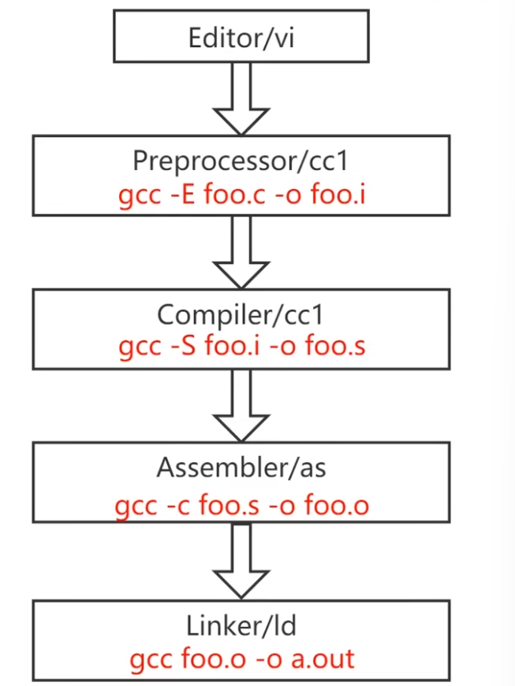

# RISC-V编译与连接

## GCC
### GCC简介
GCC（GNU Compiler Collection）
是由GNU开发的，遵循GPL许可证发型的编译器套件，支持C/C++/Objective-C、Ada和Go语言等多种语言前端，已经被移植到多种计算机体系架构上，例如X86、ARM、RISC-V等。


### GCC的命令格式
GCC 常用的选项有-E、-c、-S、-o、-g、-v等等
- -E，用来做预处理
- -c，只编译不链接，生成目标文件"-o"
- -S, 生成汇编代码
- -o file，把输出文件指定到文件名中
- -g，在输出文件中加入支持调试的信息
- -v，显示详细的命令执行过程信息
```bash
gcc [options] [filenames]
```




### GCC执行步骤


### GCC涉及的文件类型


## ELF