| 类型| 名称 | 链接| 描述|
|----------|--------|--------|--------|
| 网站 | RISC-V官网 | [RISC-V官网](https://riscv.org)                                                        | RISC-V官方网站           |
| 代码仓库 | RISC-V-Learning| [RISC-V-Learning](https://github.com/riscv/learn)                                      | RISC-V学习资源           |
| 教程     | From Blinker to RISC-V | [From Blinker to RISC-V](master/FemtoRV/TUTORIALS/FROM_BLINKER_TO_RISCV/README.md)     | RISC-V入门教程           |
| 代码仓库 | RISC-V体系结构编程与实践仓库代码 | [RISC-V体系结构编程与实践仓库代码](https://github.com/runninglinuxkernel/riscv_programming_practice) | RISC-V编程实践代码       |
| 代码仓库 | ChipYard | [ChipYard](https://github.com/ucb-bar/chipyard)                                        | RISC-V SoC设计框架       |
| 视频     | ChipYard Introduction | [ChipYard Introduction](https://www.youtube.com/watch?v=EXbs5VSv19c&t=2s)              | ChipYard项目介绍视频    |
| 文档     | RISC-V官方最新白皮书 | [RISC-V官方最新白皮书](https://github.com/riscv/riscv-isa-manual/releases/tag/riscv-isa-release-568e50a-2024-07-12) | 最新的RISC-V指令集白皮书 |
| 视频     | RISC-V Summit North America 2023   | [RISC-V Summit North America 2023](https://www.youtube.com/playlist?list=PL85jopFZCnbMfMRR25ENcRkhhAUGwP5C5) | RISC-V顶级会议视频集     |
| 代码仓库 | XiangShan's Github                 | [XiangShan's Github](https://github.com/OpenXiangShan/XiangShan)                       | 开源高性能RISC-V处理器   |
| 代码仓库 & 文章|RISC-V's GPU | [RISC-V's GPU](https://www.eet-china.com/mp/a304256.html) |[vorex](https://github.com/vortexgpgpu/vortex) |
| 代码仓库 & 文章| RVGPU | [博客](https://blog.csdn.net/u014756627/article/details/133792944) | [rvgpu仓库](https://gitee.com/rvgpu) |

Semico Research 预测
Counterpoint 预测

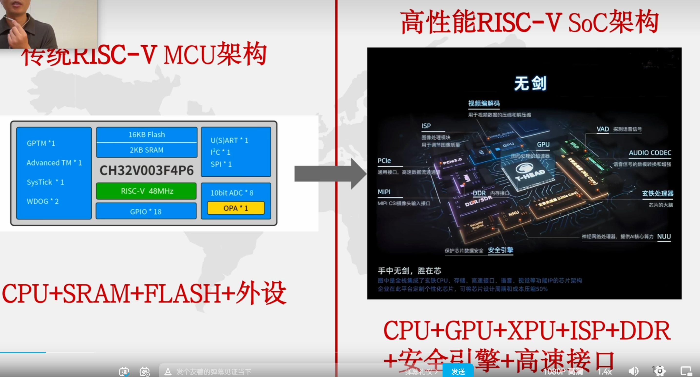

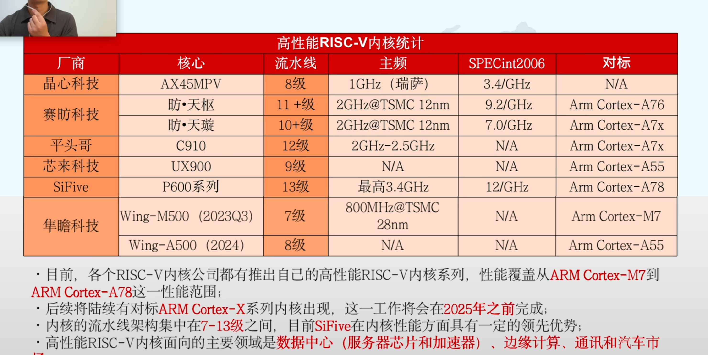

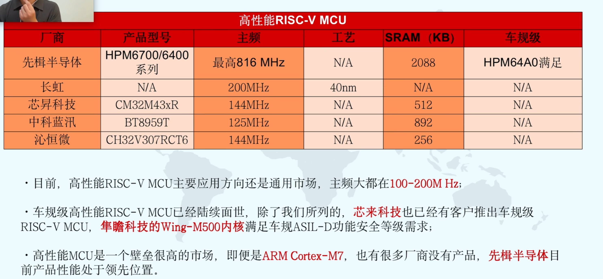

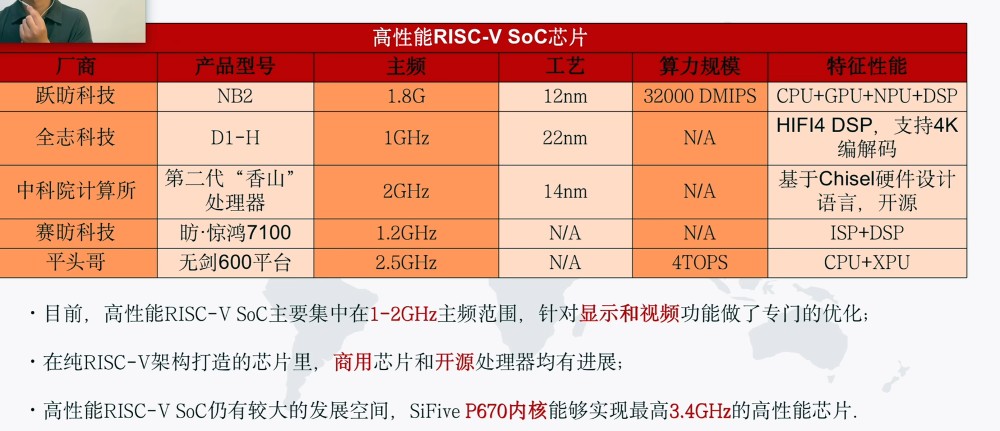

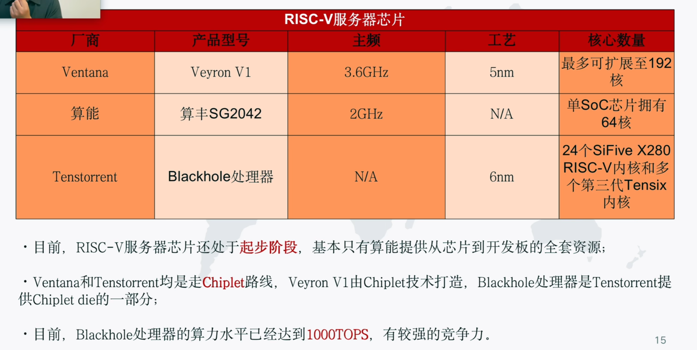

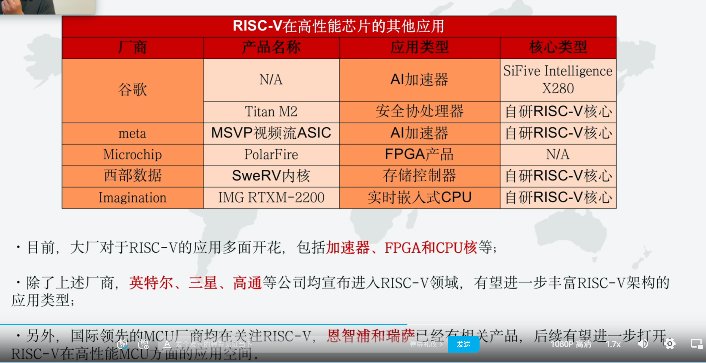

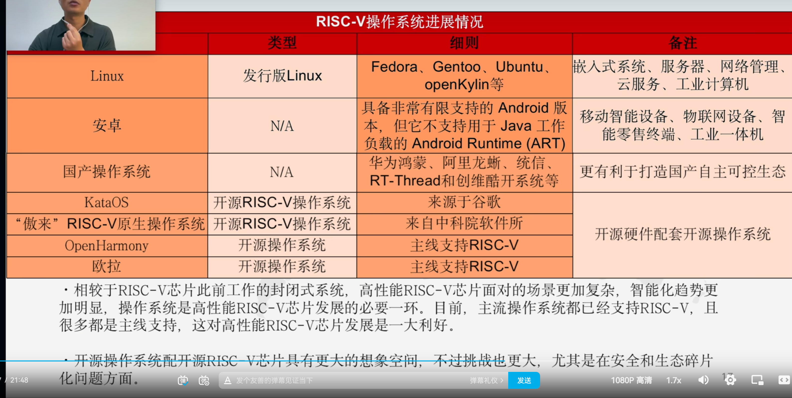

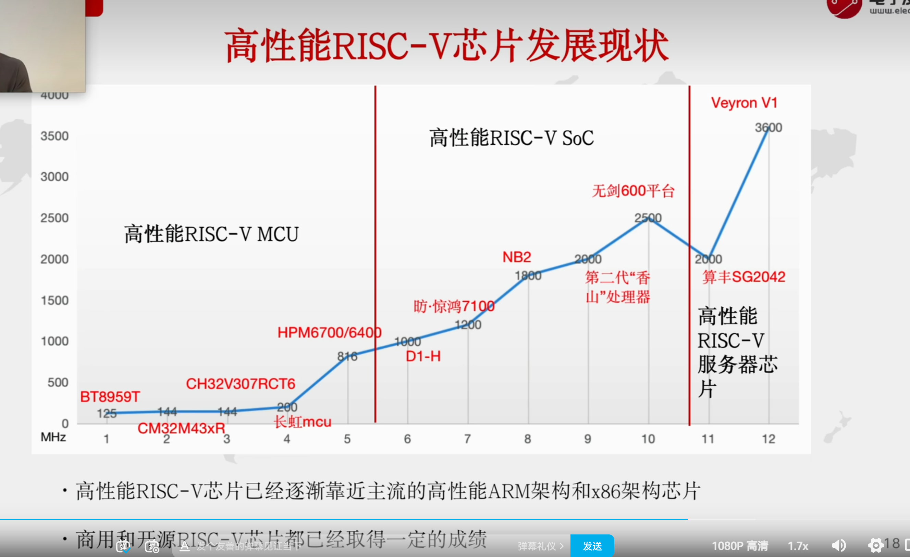

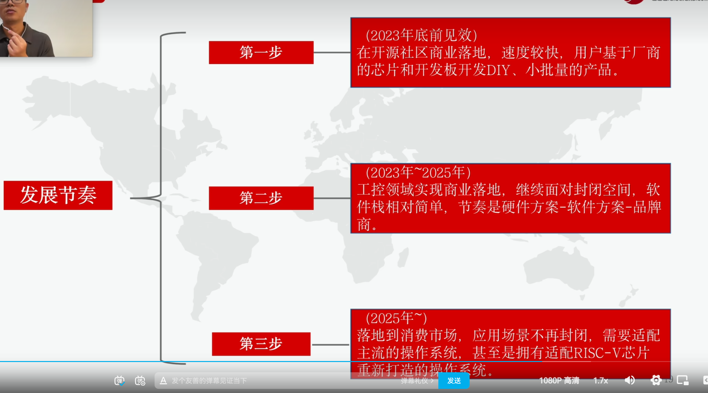

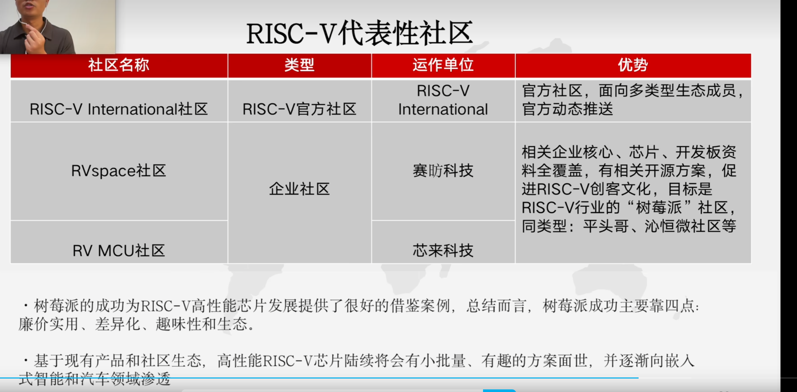

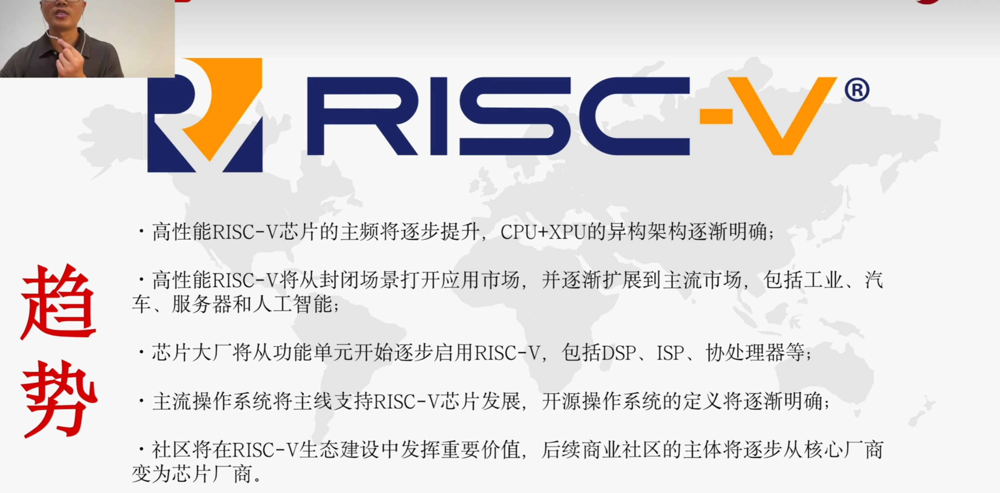

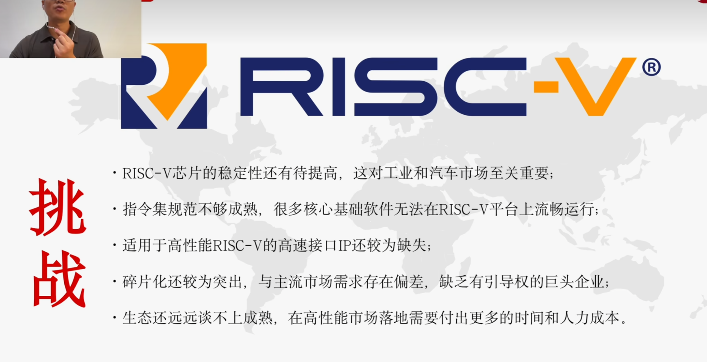

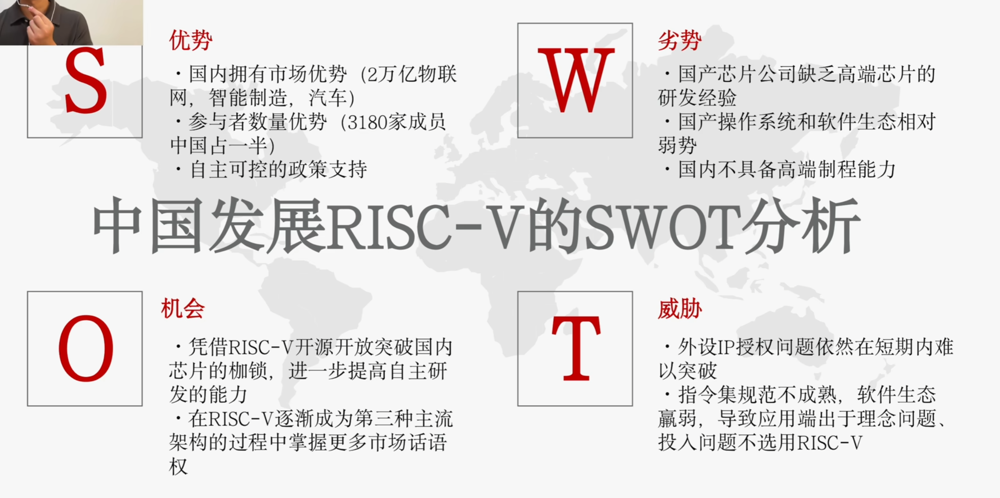

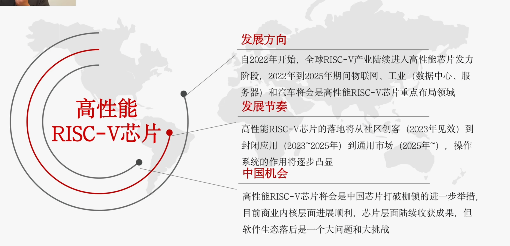

乐鑫esp32

David Patterson 发明的RISC-V

免费 ？开放！

操作系统也模块化，根据RISC-V的模块来进行处理

影响相容性？risc-v适合用在专用领域，并不是为了取代X86和arm，为了自己家的服务。

有效运行neural engine、GPU、FPGA
