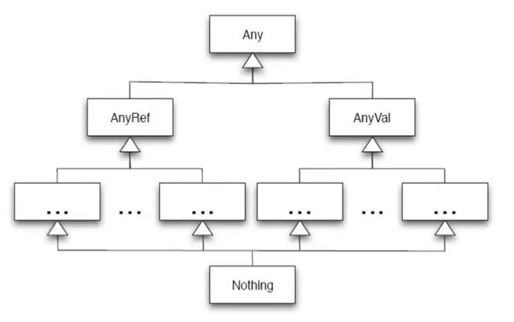

# Scala快速入门
为大家整理了一些关于Scala的入门教程以及手册，下边是一些粗略的对于Scala的语法学习，方便快速过渡到Chisel的学习当中。如果要深入了解Scala，请自行移步到以下网站中中进一步学习。

> 1. [Scala 菜鸟编程](https://www.runoob.com/scala/scala-basic-syntax.html)
>
> 2. [Scala 官方教程](https://docs.scala-lang.org/zh-cn/)

## 1. Scala简介
Scala(Scalable Language)在语言设计上支持大规模软件开发，是一种多范式的编程语言。Scala运行在Java平台(Java虚拟机)上，原生支持现有的Java程序。

Scala不仅可以独立编译，还可以调用Java类库。Scala同时支持面向对象和函数式编程。具体来说：

> **面向对象特征：**
> 1. 类和对象
> 2. 继承和多态
> 3. 抽象类
> 4. 封装

> **函数式编程特征：**
> 1. 高阶函数
> 2. 不可变性
> 3. 模式匹配
> 4. 闭包


例如Twitter、Netflix、Airbnb、Apple等公司都选择使用Scala，不仅因为其高效的并发处理能力，还有其与Java的互操作性以及强大的类系统。

在安装Chisel过程中便会提前安装好Scala，因此无需再进一步安装。

## 2. 基础使用
Scala可以使用交互式编程，首先在linux命令行中键入`scala`，如果能看到以下输出，则说明安装成功：
```bash
Welcome to Scala 2.11.12 (OpenJDK 64-Bit Server VM, Java 11.0.24).
Type in expressions for evaluation. Or try :help.

scala> 1+1
res0: Int = 2

scala>
```

除了命令行之外，我们可以可以通过创建一个`HelloWorld.scala`文件来执行代码，代码如下所示：
```scala
object HelloWorld {
    // 这是第一个scala程序
    def main(args: Array[String]) = {
        println("Hello World") // 将会输出Hello World
    }
}
```
下面我们使用scalac命令来编译它：
```bash
➜  01_test scalac HelloWorld.scala
➜  01_test ls
'HelloWorld$.class'   HelloWorld.class   HelloWorld.scala
```
成功编译之后我们可以看到三个文件，编译后我们可以使用以下命令来执行程序：
```bash
➜  01_test scala HelloWorld
Hello World
➜  01_test
```

## 3. 数据类型
Scala的数据类型和Java使用以及范围基本一致，但是其首字母都是大写，例如Byte、Short、Int、Long等诸多数据类型。

`Unit`表示没有值的意思，和其他语言的void相同。Null表示空值或者空引用。Nothing是所有类型的子类型。Any是所有类型的超类，任何实例都属于Any类型。AnyRef是所有引用类型的超类，AnyVal是所有值类型的超类。

<p align="center">
  
</p>

几个容易混淆的概念区别：
|名称|含义|
|---|---|
|Null|Trait，实例为null，是AnyRef子类，不是AnyVal子类|
|Nothing|Trait，所有类型子类，没有实例|
|None|Option两个子类之一，另一个是Some，用于安全的函数返回值|
|Unit|无返回值的函数类型，和void对应|
|Nil|长度为0的List|


## 4. 变量声明
Scala定义变量使用var，定义常量使用val，变量和常量类型可以省略不写，会自动推断。**默认使用val**
每一行后都会有分号自动推断机制，不用显式写出“;”。


scala中的class可以传参，必须指明类型。
```scala
class Person(pname: String, page: Int) {
    val name = pname
    val age = page
}

object test {
    def main(args: Array[String]): Unit = {
        val p = new Person(pname="zhangsan", page=25)
    }
}
```

Scala类中有了参数就有了默认的构造，传参必须要指定类型，同时也可以用val和var修饰。

类中的属性默认都有getter和setter。

那如何在类中重写构造呢？
```scala
class Person(pname: String, page: Int) {
    val name = pname
    val age = page
    var gender = 'M'
    def this(yname:String, yage:Int, ygender:Char) {
        // 先调用默认构造
        this(yname, yage)
        this.gender = ygender
    }
}
```

Scala当new class时，除了方法不执行，其他都会执行。


在同一个scala文件中，当class和object名称一样时，这个类叫做这个对象的伴生类，二者可以互相访问私有变量。

object不可以传参。但是可以定义`apply`，传默认参数的时候，会调用apply，同样apply可以重载。


## 5. 简单语法
在Scala中，`if...else`和java基本一样，如下所示：
```scala
    val age = 20
    if (age <= 20) {
        println("age < 20")
    } else if() {

    } else {

    }

```
除了分支指令之外，`for`循环指令和java稍有不同：
```scala
    // 使用<- 来表示赋值
    for(i <- 1 to 10) {
        // to 是一个range集合，包含10
        // until 不包含10
    }

    // 可以等价成
    val r = 1.to(10)
    val r1 = 1.until(10)


    // 这是一个双重for循环
    for(i <- 1 until 10) {
        for(j <- 1 until 10) {
            if(i>=j) {
                print(i+"*"+j"="i*j"\t")
            }
            if(i==j) {
                println()
            }
        }
    }
    // 可以简化成一个for中用；来分隔
    for(i <- 1 until 10; j <- 1 until 10) {
        ...
    }
    // 在（）中可以放很多个条件，使用为从左到右
    for(i <- 1 to 1000; if(i>500);if(i%2==0)) {
        println(i)
    }
    // 同时也可以将for的结果作为参数来返回到一个变量中
    val result = for(i <- 1 to 1000 if(i>500) if(i%2==0)) yield i

```

Scala的while和do..while的类型同样和java基本一致。
```scala
var i = 0
while(i < 100) {
    ...
    // 没有i++
    i = i+1
    // i += 1
}

```

## 6. 方法与函数
**1. 最常见的方法格式**
```scala
object Test {
    def main(args: Array[String]: Unit) = {
        def max(x: Int, y:Int): Int = {
           if(x > y)
                x
            else 
                y
        }
    }
}
```
方法体最后返回值可以使用return，如果使用了return，那么方法体的返回值类型一定要指定，如果没有return，方法体的返回值可以省略，会自动推断返回值的类型。默认将方法体中最后一行当做返回值返回。

实际上上边那个方法体可以简化，定义方法体传入的参数一定要指定类型；

```scala
def max(a: Int, b: Int): Int = if(a > b) a else b
```

方法体如果可以一行搞定，那么方法体的{}可以省略

如果定义方法时，省略了方法名称和方法体之间的=，那么无论方法体最后一行计算体的计算结果是什么，都会被丢弃，返回Unit，并且需要使用def来定义方法。

**2. 递归方法**
```scala
def fun(num:Int): Int = {
    if(num==1) {
        1
    } else {
        num*fun(num-1)
    }
}
```
递归方法要显式声明函数类型

**3. 参数有缺省值的方法**

和python的缺省值类似，用`=值`来提供缺省值
```scala
def fun(a:Int=10, b:Int=20): Int {
    a+b
}
```


**4. 可变长参数的方法**

如果要传同种类型的方法，可以在形参后边加上*号。
```scala
def fun(s:String*) = { // 可以传同种类型的
    println(s)
    s.foreach(elem=>{println(elem)}) // =>是匿名函数的意思
    s.foreach(println(_))
    s.foreach(println)
}
```


**5. 匿名函数**
`=>`这个符号便是匿名函数最显著的特征，其格式如下：
`()=>{}`
```scala
def fun = (a:Int,b:Int)=>{
    a+b
}

```
当方法的参数是函数时，可以使用匿名函数

**6. 嵌套方法**

可以在函数里边再次声明函数，也就是函数的嵌套。
```scala
def main() {
    def test1(a:Int) = {
        def test2(b:Int) = {

        }
    }
}
```


**7. 偏应用函数**

关于偏应用函数的概念，具体可以查看这个[文档](https://www.runoob.com/scala/partially-applied-functions.html)


```scala
def showLog(date:Date,log:String) = {
    println(s"date is$date, log is $log")
}

def fun = showLog(date,_:String)
```

当方法参数非常多的时候，调用非常频繁，每次调用只有固定的某个参数变化，可以定义偏应用函数来实现。也就是说用fun来代替showLog，这样每次只需要传入一个参数，另一个参数可以固定下来。

**8. 高阶函数**
- 方法的参数是函数，
```scala
def fun(a:Int,b:Int):Int = {
    a+b
}

def fun1(f:(Int,Int)=>Int, s:String):String = {
    val i: Int = f(100, 200)
    i+"#"+s
}

fun1(fun, "hello")
```

处理逻辑是手动传进去的,只需要格式是对应的形式即可。


- 方法的返回是函数：
```scala
def fun(s:String):(String,String)=>String = {
    def fun1(s1:String,s2:String):String = {
        s1+" hello "+s2 + " world " + s
    }

    fun1
    // fun1 _ (可以省略返回值，用fun1 + _来替代)
}
```

必须显式的要写出方法的返回值类型。


- 方法的参数和返回都是函数
```scala
def fun(f:(Int,Int)=>Int):(String, String)=>String = {
    val i:Int = f(1, 2)
    def fun1(s1:String,s2:String):String = {
        s1+"@"+s2+"*"+i
    }
    fun1
}

fun((a,b)=>{a+b})("hello", "world")
```

- 柯里化函数
```scala
def fun(a:Int,b:Int)(c:Int,d:Int) = {
    a+b+c+d
}
fun(1,2)(3,4)
```

高阶函数第二种函数的简化，只是一种简便的定义方式


## 7. 数据结构

**1. 字符串**

Scala中常见的数据结构有字符串、数组、集合，针对他们有创建、遍历迭代以及各种方法。

相对于java来说，字符串为常量，它的类型为String(java.lang.String)。在Scala中，实际上本身没有String类，他的对象不可被修改，如果想修改字符串，就会产生一个新的字符串对象。

有以下几种创建方式：
```scala
val str1: String = "Hello World!"
val str2 = "Hello World"
```

实际上它会进行类型推导，并不用显式写出字符串类型。

如果需要创建一个可以修改的字符串，可以使用`StringBuilder`类：
```scala
val buf = new StringBuilder
```

字符串有诸多方法，例如求长度，判断是否相等，具体字符串的使用方法可以查看以下[文档](https://docs.oracle.com/en/java/javase/11/docs/api/java.base/java/lang/String.html)。例如`s.equals(s1)` `s.equalsIgnoreCase(s1)` `s.indexOf`等等


**2. Array**

数组有两种声明方式，可以使用`new`, 也可以直接使用，他们分别表示为创建类以及创建对象，下边是他们的使用方式：
```scala
package test1.scala

object Test_Array {
    def main(args: Array[String]): Unit = {
        val arr = Array[String]("a","b","c") // 直接把内容放进去
        arr.foreach(println)

        val arr1 = new Array[Int](4) // 表示当前有几个元素
        arr(0) = 100
        arr(1) = 200
        arr(2) = 300

        // 二维数组
        var arr2 = new Array[Array[Int]](3)
        arr2(0) = Array[Int](1,2,3)
        arr2(1) = Array[Int](4,5,6)
        arr2(2) = Array[Int](7,8,9)

        for(a<-arr2;elem<-a) {
            println(elem)
        }

        arr2.foreach(a=>{a.foreach(println)})
    
        Array.concat(arr,arr1)
        Array.fill(5)("Hello") // 初始化长度位5，每一个都是Hello的数组

        // 上边都是不可变的
        import scala.collection.mutable.ArrayBuffer
        val arr = ArrayBuffer[Int](1,2,3)
        arr.+=(4) // 尾插
        arr.+=:(100) // 头插
        arr.append(7,8,9)
    }
}
```

**3. 集合**
Scala的集合分为可变集合和不可变集合。它放在了Scala包的collection中。[Collection链接](https://www.scala-lang.org/api/3.4.2/scala/collection.html)


常见的集合有：
| 名称  | 作用|
| ---  | --- |
| List | 以离散的线性方式存储，可以存放重复对象|
| Set  | 最简单的一种集合，不按特定的方式排序  |
| Map  | Map是一种把键对象和值对象映射的集合  |
| 元组  | 元组是不同值的集合|
| Option[T]| 表示有可能包含值的容器，也有可能不包含值|
| Iterator| 迭代器，不是容器，是逐一访问元素的一种方法|


**List:**
只有Array可以new，其他的都不可以new
```scala
val list = List[Int](1,2,3)
list.foreah(println)

val list = List[String]("hello yes", "hello no", "hello or")
valresult = list.+("aaa") // 给List后边整体拼了一个aaa，而不是在list里边拼一个aaa


list.map(s => {
    s.split(" ")
})


list.flatMap(s=>{s.split(" ")})
list.fliter(s=>{"hello yes".equals(s)})
list.count(s=>{s.length>4})

// 可以变的List
val list == ListBuffer[Int](1,2,3)
list.foreach(println)
list.append(4,5,6)
```

**Set**

```scala
val set = Set[Int](1,2,3,4,4,5)

set.foreach(println) // 可以去重，默认不可变

vet set1 = Set[Int](3,4,5)

val result: Set[Int] = set.intersect(set1)
set.diff(set1)

val result1 = set & | ~ set1
```


可变长的Set，没有Setbuffer，
```scala
import scala.collection.multable.Set // 导入这个包之后就是可变的了

val set = Set[Int](1,2,3)
set.+=(100)


val set1 = immutable.Set[String]("a", "b")
```


**Map**

Map是一种可以迭代的键值对(Key/Value)结构，所有的值都可以通过键来获取，Map的键都是唯一的，Map也叫做哈希表，有两种类型，可变与不可变。默认情况下Scala使用不可变Map，如果需要使用可变集合，需要显式引入`import scala.collection.mutable.Map`类，也可以同时使用可变Map与不可变Map，可变使用`mutable.Map`，不可变使用`Map`。
```scala
val A:Map[Char, Int] = Map()

val colors = Map("red" -> "#FF0000", "azure" -> "#F0FFFF")

A += ('I' -> 1)
A += ('J' -> 2)
```


Scala Map有三种操作。
|方法|含义|
|---|---|
|keys|返回Map所有的键|
|values|返回Map所有的值|
|isEmpty|在Map为空时返回true|

更多有关Map的操作，可以去查看一下[文档](https://www.runoob.com/scala/scala-maps.html)


**Tuple**
与列表一样，元组也是不可变的，但是元组可以包含不同类型的元素，元组的值是通过将单个的值包含在圆括号中构成的，包括：
```scala
val t = (1, 3.14, "Hello")
val t = new Tuple3(1, 3.14, "Hello")
val t = new Tuple2(1, 3.14)
```
以上实例在元组中定义了三个元素，分别对应Int、Double、String。元组的实际类型取决于它的元素类型，目前Scala支持的元组最大长度为22，更大的可以使用集合。

它的访问方式为：
```scala
val t = (4, 3, 2, 1)
val sum = t._1 + t._2 + t._3 + t._4
```

可以使用迭代元组来输出元组的所有元素：
```scala
val t = (4,3,2,1)
t.productIterator.foreach{i => println("Value = " + i)}
```


