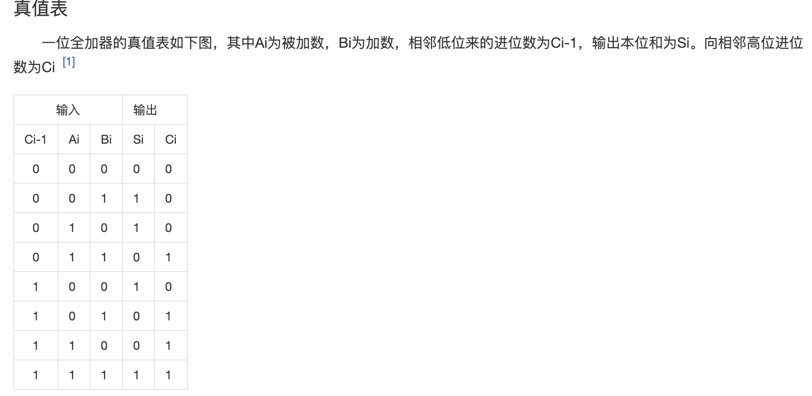
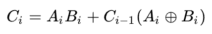
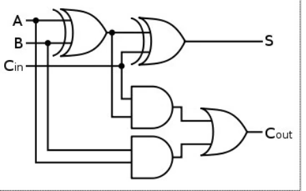

# Hello Chisel
安装好Chisel并且快速学习Scala之后，我们便可以愉快的进行Chisel编程开发啦！

Chisel是UC Berkeley在2012年开发的一套针对RISC-V的硬件构建语言，拥有诸多优势，例如抽象层次高（很像java开发），易于扩展，可读性高，开源支持等等。

Chisel的编译过程为：
Chisel --》 Scala --》 Java on JVM

Chisel引入了OOP和函数式编程，可以更好的进行敏捷开发。
## 0. Chisel工程开发技术栈
我们的技术栈如下：
```
操作系统： Linux（Ubuntu22.04）
语言环境： Scala/Java
Chisel只是Scala的一个库

仿真工具： Verilator(Verilog 仿真)
波形查看： GTKWave(波形查看)
FPGA开发工具：Vivado(Xilinx)
```

首先我们来看一下全加器的真值表：

<p align="center">
    
</p>

其中数字逻辑表达式为：
<p align="center">
    
</p>

我们可以看一下它的电路图：
<p align="center">
    
</p>

将上述电路图转化为Chisel代码如下：
```scala
import chisel3._

class FullAdder extends Module {
    val io = IO(
        new Bundle {
            val a = Input(UInt(1.W))
            val b = Input(UInt(2.W))
            val cin = Input(UInt(1.W))
            val sum = Output(UInt(1.W))
            val cout = Output(UInt(1.W))
        }
    )

    val s1 = io.a ^ io.b
    io.sum := s1 ^ io.cin
    val s3 = io.a & io.b
    val s2 = s1 & io.cin
    io.cout := s2 | s3
}
```

在完成代码后，可以使用`sbt run`来编译，查看自己的代码是否能够正确编译。

## 1. Chisel工程示例

在学习完上边的全加器之后我们可以进一步看一下LED闪烁的chisel工程示例：
```scala
import chisel3._ // 每次都需要导入这个包

class LED extends Module {
    val io = IO(
        new Bundle {
            val led = Output(UInt(1.W))
        }
    )

    val CNT_MAX = (50000000/2-1).U

    val cntReg = RegInit(0.U(32.W)) // 寄存器作为计数器
    val blkReg = RegInit(0.U(1.W))

    cntReg := cntReg + 1.U // 从右向左赋值
    when(cntReg == CNT_MAX) {
        cntReg := 0.U
        blkReg := ~blkReg
    }
    io.led := blkReg // 接到外部线中
}

object LED extends APP {
    (new chisel.stage.ChiselStage).emitVerilog(new LED(), Array("--target-dir","generated")) // 输出Verilog文件
}
```

在生成功能之后，我们可以对他进行验证和功能仿真，可以使用Chiseltest。
仿真过程如下：
- 编写测试程序
    - 创建src/test/scala/目录
    - 编写测试源代码
- 运行测试程序并输出.vcd波形文件
- 使用gtkwave软件观测波形

我们的测试代码如下：
```scala
import chisel3._
import chiseltest._
import org.scalatest.flatspec.AnyFlatSpec

class LEDTest extends AnyFlatSpec with ChiselScalatestTester {
    behavior of "LED"
    it should "pass" in {
        test(new LED).withAnnotations(Seq(WriteVcdAnnotation)) {
            c => c.clock.setTimeout(0)
            var ledStatus = BigInt(-1)
            println("Start the blinking LED")
            for(_ <- 0 until 10) {
                c.clock.step(10000)
                val ledNow = c.io.led.peek().litValue
                val s = if(ledNow == 0) "o" else "*"
                if(ledStatus != ledNow) {
                    System.out.println(s)
                    ledStatus = ledNow
                }
            }
            println("\n End the blinking LED")
        }
    }
}
```

之后运行`sbt test`来查看对应的