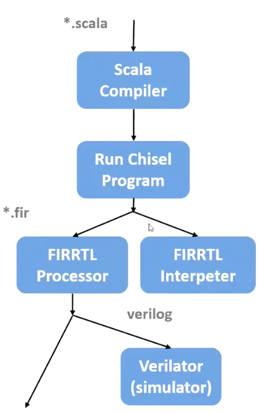

# Chisel编程指北

目前国内针对Chisel的了解还是比较少的，为了方便未来的编程，本系列笔记旨在速成对于Chisel的了解与学习，帮助大家快速的开发。

首先我们需要看一下Chisel究竟是什么东东，为什么我们需要用这个玩意来学习。

下边我们开始吧，始吧，吧~

Chisel是伯克利在发明RISC-V的时候顺带产生的一个硬件描述语言， 它是Scala嵌入式语言的子集。

可以将设计硬件转换为Verilog等低层次HDL描述

